# hw6

**(Due: 04/03/23) Monday 6pm**

## Part 0 : Open jupyter notebook on pynq board cluster

[step 1] Allocate pynq board resources through [slurm workload manager](https://slurm.schedmd.com/quickstart.html). Make sure you're connected to Georgia Tech network or through the GT VPN.
```
[local]$ ssh [your GT account username]@synestia2.cc.gatech.edu
[synestia2]$ . /net/cs3220_share/student_scripts/init_student_vivado_env.sh
[synestia2]$ run-jupyter-pynq.sh
```
Running the scripts will allocate a 1-hour job on one of the available pynq boards. When prompted for password please enter the password for your GT account. 


[step 2] If the job launch was successful, you should see instructions like this:
```
Submitting job via sbatch lab1.sbatch...
Submitted batch job 1386

Job successfully submitted!
Waiting for job to start...

The authenticity of host 'pynq-z2-35 (130.207.113.112)' can't be established.
ECDSA key fingerprint is SHA256:KQwfmg8xjzp90Ro9Owk/nE4LaAJ4zIvn9+sd28k9Ydg.
Are you sure you want to continue connecting (yes/no/[fingerprint])? yes
Warning: Permanently added 'pynq-z2-35,130.207.113.112' (ECDSA) to the list of known hosts.
jtong45@pynq-z2-35's password: 
Starting jupyter notebook...

Connect to your jupyter notebook via the following steps:
   1) Press SHIFT + ~ then SHIFT + C to open an SSH console (The prompt 'ssh>' should appear on the next line)
      ***Note: '~' MUST be the first character on the line to be recognized as the escape character, in which case it will not appear on your terminal.***
      ***If you see the '~' character when you start typing, delete it, hit 'ENTER' and type 'SHIFT' + '~' + 'C' again.***
   2) Type -L :pynq-z2-35: and then ENTER
   3) Connect your browser to http://localhost:/
```


The above message shows the ip address of the PYNQ board, which is '130.207.113.112', then copy '130.207.113.112' into the URL in the browser and open PYNQ notebook, the notebook password is ```xilinx```.

You could also follow the prompted instructions and start your jupyter notebook. The SSH console commands may not work for VS Code terminals. The notebook password is ```xilinx```.

Other useful instructions:
- ```sinfo``` checks the status of pynq board resources and show whether they are down, allocated or idle(available)
- ```squeue``` shows information about current submitted jobs
- ```scancel [job id]``` terminate a current job. Get your job id by ```squeue```
- ```slurm-jupyter-notebook -p pynq-cluster -N 1 --job-name lab2 --time=[Required time, e.g. 90:00]``` allow you to specify a longer job time
- adding ```-w [board name, e.g. pynq-z2-30]``` to the above command allow you to specify the board you want to access. When using this option please first make sure the board is shown ```idle``` with ```sinfo```

Common platform issues (WIP):
- When running ```run-jupyter-pynq.sh``` terminal prints ```ssh: Could not resolve hostname ps aux | awk "match(\\$0,/jupyter.*port=([0-9]*)/,a) {print a[1]; exit}": Device or resource busy``` and doesn't assign board; root cause unclear, could be racing condition when multiple users trying to access resource. Increase sleep time or rebooting might help. Temporal solution: try again or specify another pynq board with the ```-w``` option.
- When loading overlay in the first notebook block it prints TimeoutError ```[Errno 110] Connection timed out```; boards that give timeout need rebooting. Resolving the issue with test script improvement (WIP). Temporal solution: try again or specify another pynq board with the ```-w``` option.

## Part 1 : Follow the overlay tutorial with providied bistream  

In this part you'll run a tutorial program on jupyter notebook with tutorial bistream.

This instruction is based on [this tutorial](https://pynq.readthedocs.io/en/v2.0/overlay_design_methodology/overlay_tutorial.html). 
The tutorial file is copied from this repo: https://github.com/PeterOgden/overlay_tutorial.git 


[step 1] Check out hw6_files from the class git

[step 2] Go to the directory with your GT account ID and upload files to pynq board's ARM processor  
(scalaradd.ipynb, tutorial_1.bit, tutorial_1.hwh) 
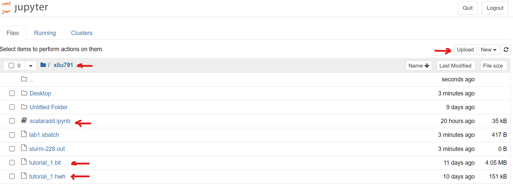

[step 3] Open scalaradd.ipynb in jupyternotebook and edit the file location to your directory (```/nethome/[GT account ID]```) in cell 1 and 7
 
Press the run button for each cell and see whether it works or not. 
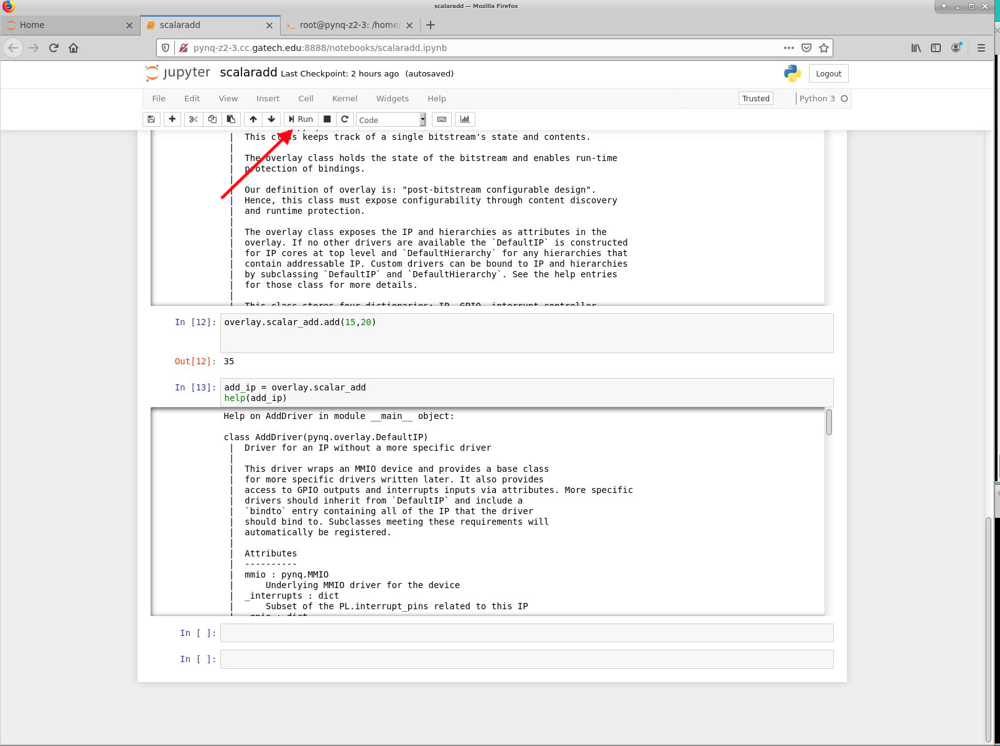

## Part 2 : Generate and run your own bistream
In this part, you will create a bitstream from Vivado and extend the tutorial to load your own bitstream design. 

### Step-Vitis: Open Vitis HLS and generate ip


**Start Vitis HLS program (similar to HW#5)**
Note that the following figures are using a different version of HLS, pls follow the texts if the figure looks different from the Vitis HLS/Vivado in synestia cluster.

[1] Click on “Create New Project” in the very first page.

[2] Specify the “Project name” and “location” of the project

[3] Click on “Add Files…” to add “add.cpp” and “adder.h”. Put "add" as the top function. Do not add the test file yet.

[4] In the same window, click on Browse, to choose the top function (you can add it later).

[5] In the next window, click on “Add Files…” to add “add_test.cpp”, which is our testbench.

[6] In the next window, you can leave Solution Name and Period as it is, and just click on “…” to choose **pynq-z2** boards. Then click “Finish”.

[7] Then, your project is opened. You can see the files in the left. 

[8] If you haven't added top module, open "project settings" -> "Synthesis" and add top module "add" in this example as top function. 

[9] To test the project, you can first “Run C Simulation” (you can find it under Project tab, or in the shortcuts). Once you click on that, a window appears, in which you may choose “Launch Debugger”, if you want to debug your code. Otherwise, you can just click on “OK” to run.

[10] "Solution"->"Run C Synthesis" ->"All Solutions"

[11] Set HLS version number: "Solution" -> "Solution Settings" -> "Export" -> find "Format Selection" block and click (Configuration...) -> Modify Version as "0.0.1" in the pop-up window.
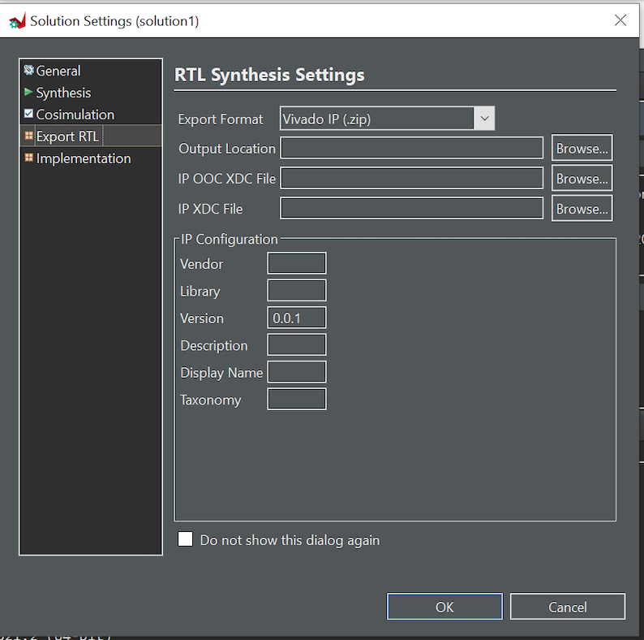

[12] "solution"->"Export RTL"   

[13] Copy AXI data register ids for inteface on the later step. The location for these IDs is in <project_name>/solution1/impl/ip/drivers/<module_name*>/src/<module_name>_hw.h

[14] Copy the data range somewhere to match with pynq boards. Please see below image as example of what data range we are talking about here. 

##define  _ADDR_*_DATA addresses 

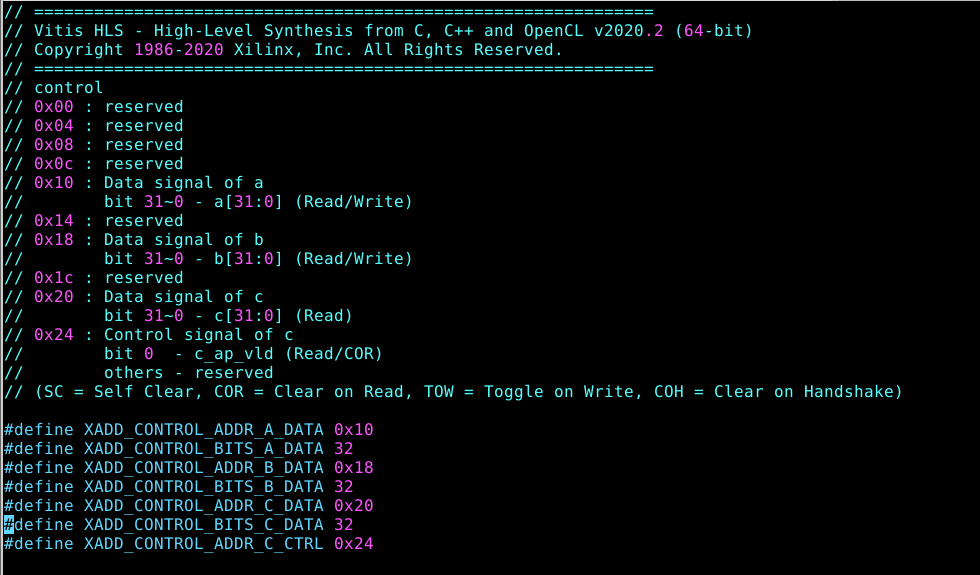 


### Step-Vivado:Open Vivado and import IP and generate Bitstream

**Start Vivado application**

[1] Create new project, select RTL project and then select pynq-z2 for your board. (you don't need to add any new files and just select default options)

[2] Click on the "IP Integrator/Create Block design," use default name "design_1", do "OK"

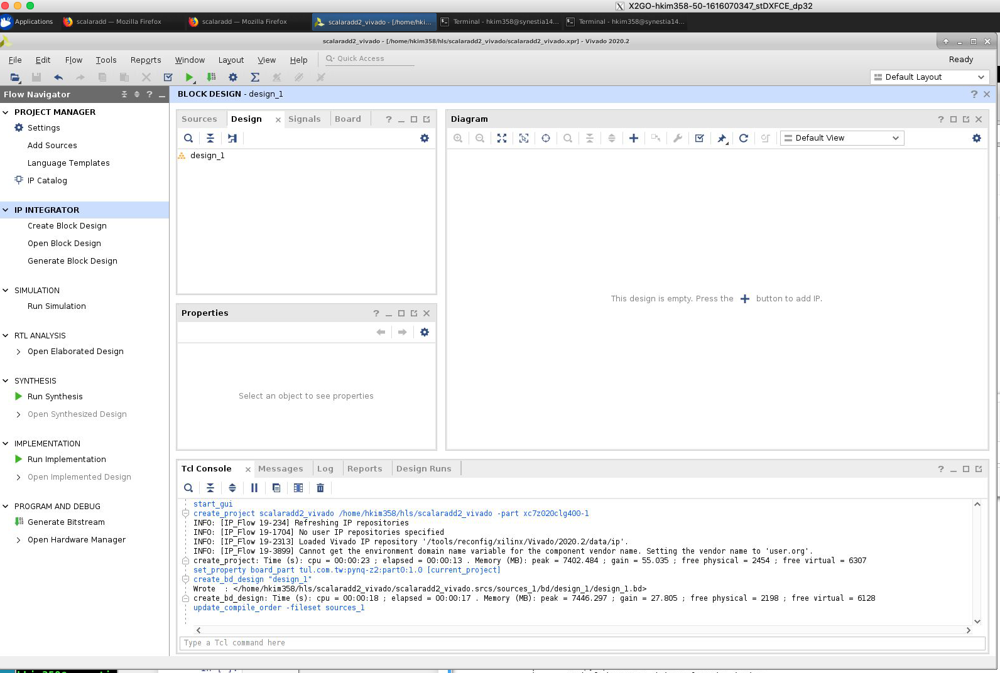

[3] Project setting -> IP -> IP Repository -> click the "+" icon to add the directory ```<project_name>/solution1/impl/ip``` from the Vitis HLS step. 

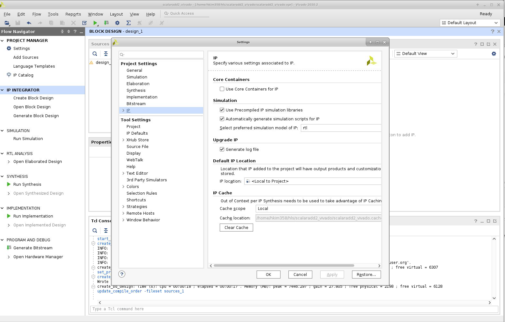

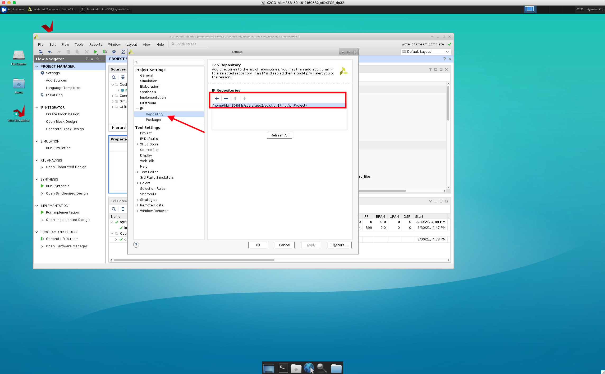

[4] Create Block Design (using default name **design_1**) -> In the Diagram Window, right click -> add ip -> search **Zynq Processing system** and add our HLS IP module **Add**.

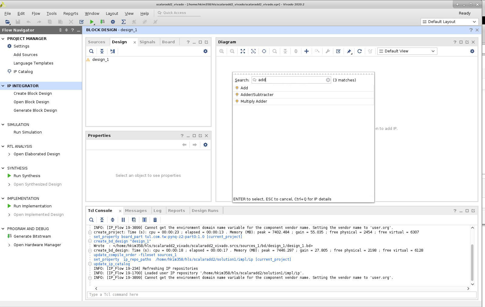


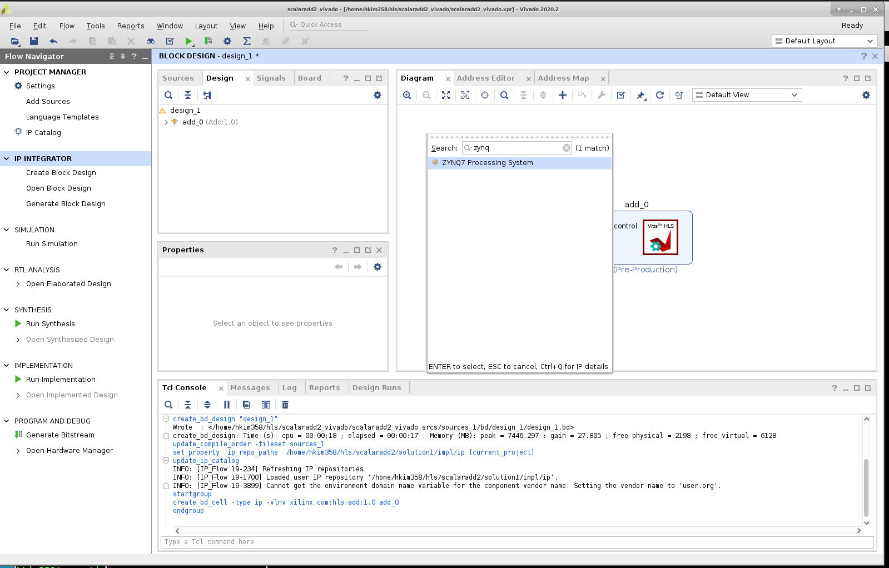 

[5] Click on the "Run block automation" and "Run connection automation" -> Click "Validate Design"

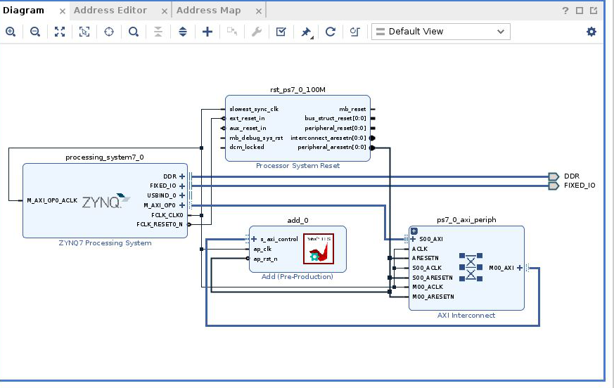

[6] Go to "sources" and right click on your block design name, click on "Create HDL wrapper". Click on "Let Vivado do ..." option and press "OK". 

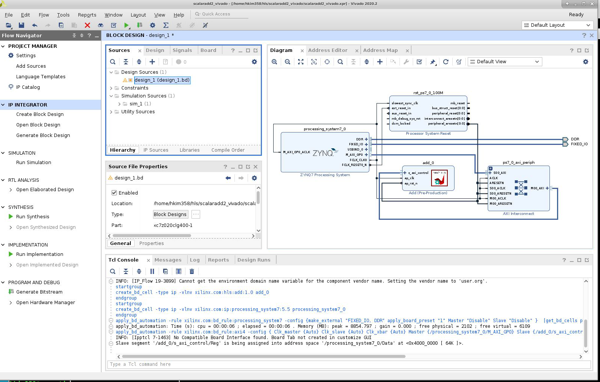

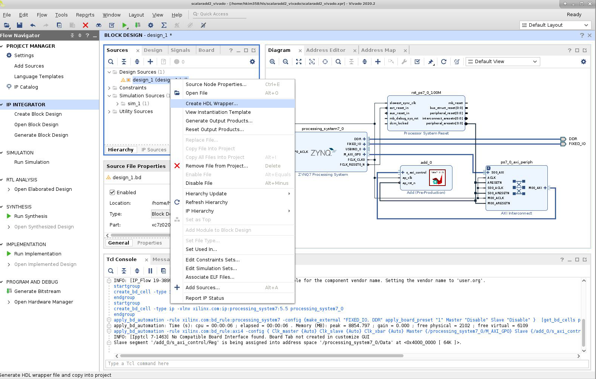

[7] Click on Project -> Generate Bitstream (it will ask to synthesize etc. and click yes) 

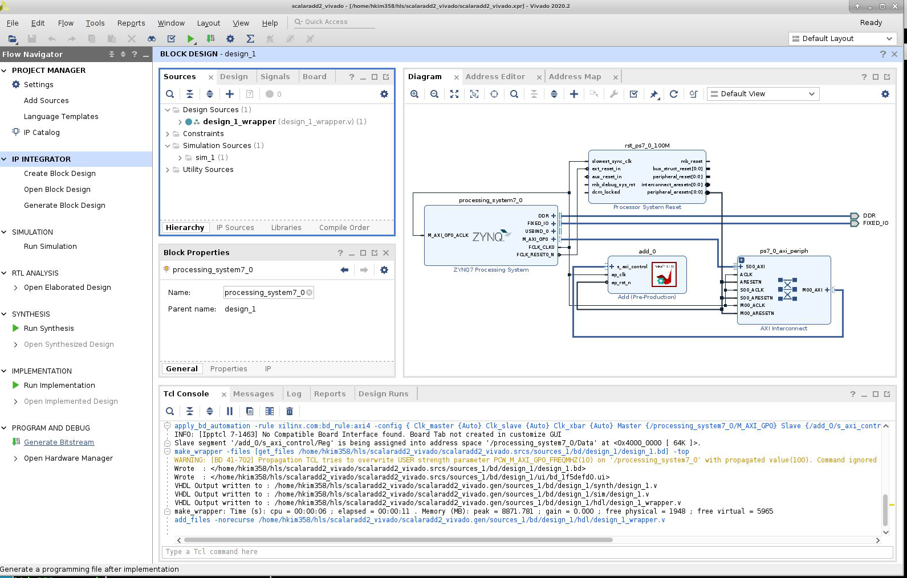

[8] Click on File->Export-> Export block design, select the option of including bitstream 

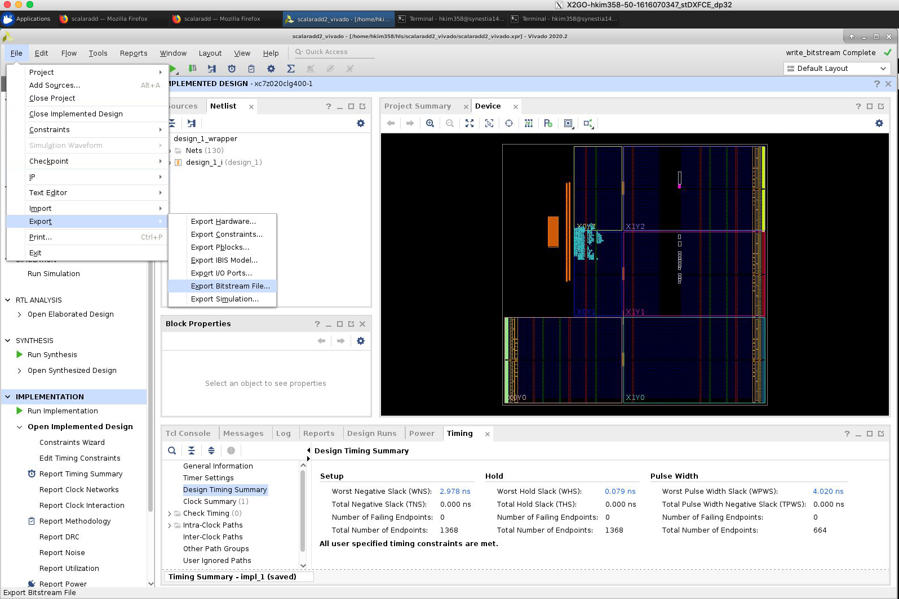 


[8.a] Copy bit stream file ```*.bit```, for example <project_name>.runs/impl_1/design_1_wrapper.bit 


[8.b] Copy tcl script file ```*.tcl```, for example <project_name>.runs/impl_1/design_1_wrapper.tcl 

[9] Copy hwh file from <project_name>.gen/sources_1/bd/design_1/hw_handoff
you can find hwh file. 

[10] Make all files in the same names (e.g. add.bit, add.tcl, add.hwh) and place where they are easy to find  

[11] Upload the three files (add.hwh, add.tcl, add.bit) into pynq boards (as you did in Part 1)

[12] Repeat part-1 using jupyter-notebook with myadd.ipynb file   


### (Optional task) Part 3 Convert the add example to take 3 inputs and change the name of module to add3

**IMP Note: Please create new Vitis HLS project and new Vivado project for part 3**

In Part 2 you created an addition IP that used 2 ports (a & b). For Part 3, you need to modify add.cpp and adder.h to make it into 3 port IP. So inputs will be a,b,c and output will be d.

```d = a + b + c```

Name of module is add3.

Overview of general steps we follow:

Step [1] Open Vitis HLS and generate ip 

Step [2] Open Vivado: Add ip and PS and generate bitstream, metafiles  

Step [3] Copy the bitstream of add3 into jupyter (pynq boards) 


Useful github links: 

PYNQ repo : https://github.com/Xilinx/PYNQ

Overlay tutorial code:  [https://github.com/PeterOgden/overlay_tutorial]


**What to submit**: Please answer the question in hw6 in canvas. 

**In order to do project #4, hw#6 needs to be completed first. Please finish it ASAP.**

