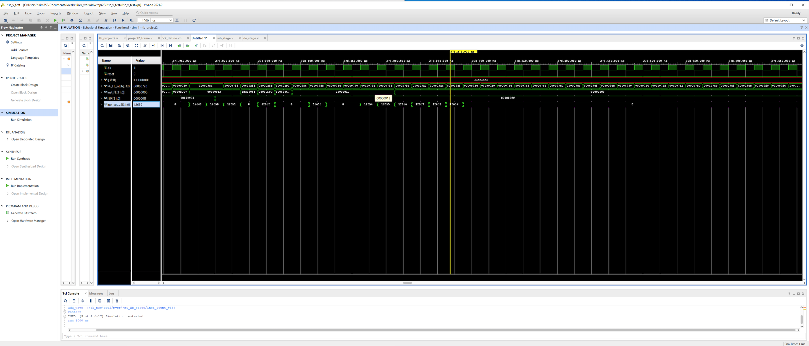
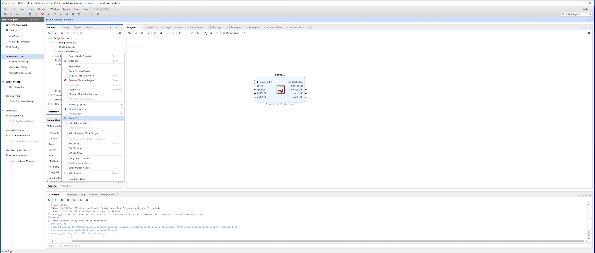
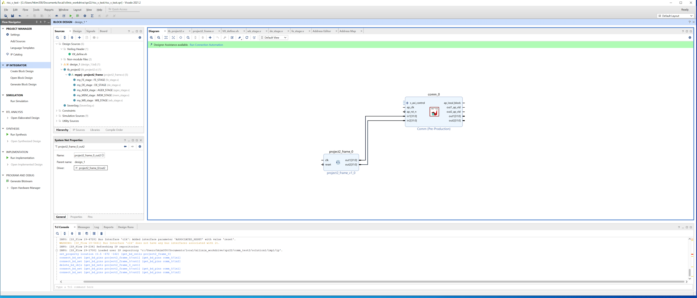
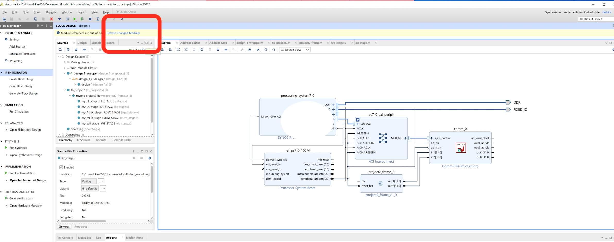
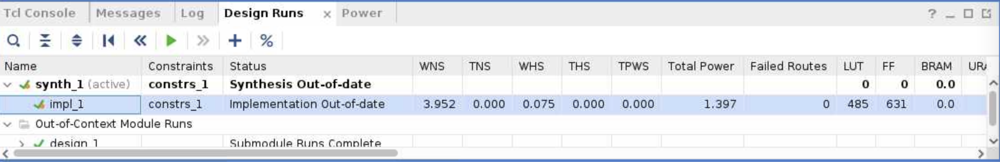
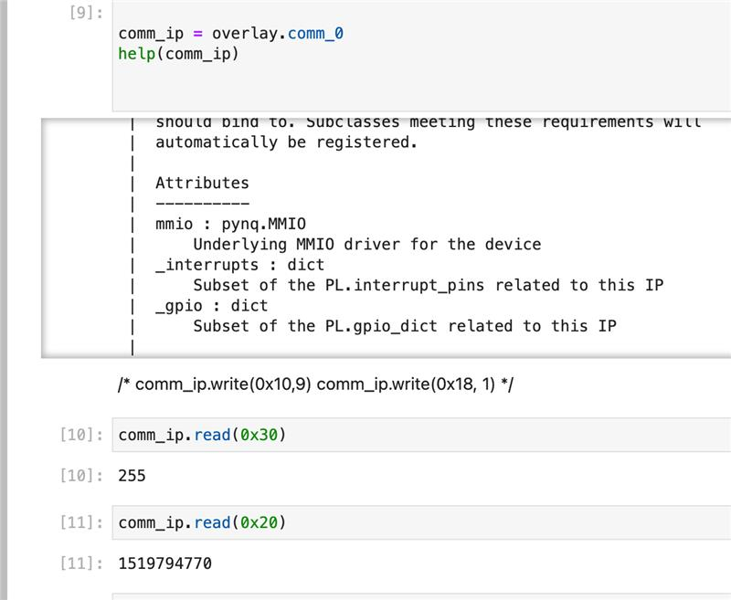

# Project 4 (10 pts + bonus point (2 pts)) 

This is a group project continuing on your *project #2*. 
In this project, you will test your RISC-V design on pynq board. 

Vivado synthesization takes 20 min for project, so please plan an ample amount of time to evaluate. 

## Part-1: Vivado Simulation (3 pts)

In this step you will simulate your design on Vivado's simulation. 
Vivado simulation models the hardware behavior more accurately than Verilator. 
If your verilog code followed general HDL rules, you code would just run fine with vivado simulation. 
But if your code has uninitialized code or sequential code, it might not work with vivado simulation. In that case, you have to debug your code.

Please make sure your add test code and set the path correctly. 
Please use the towers.mem program binary from project #2. Please note that the provided tb_project.v is testing part-2's pipeline design. so complete the step [1.a] & [2] in [part-2](#change) to make your pipeline compile with tb file. 

Please, refer to the following video for the step by step process of setting up your project inside the Vivado IDE (https://gtvault-my.sharepoint.com/:v:/g/personal/hkim358_gatech_edu/EUBkMA18qbFKifiMjaO4rN8BCrTy4NOPdCG6KvJ_Jr9cOA?e=e3ZkXN) 

You can check last_WB_value[10] show 255. The example screenshot is as follows. 


**Grading** 

If you cannot fix, your pipeline design, please contact the TAs. We will provide a working version but you will loose 2 pts. 

**What to submit** 

A screenshot to show instcount and r10 value. 
Please note that screenshot submission will be used for grading only when your part-2 fails to give a partial credit of project #4. 

##  Part-2: Optimize the pipeline and analyze the design  (7 pts)  + run it on Pynq-Jupyter (bonus point 2pts)

In this paprt, you will change your design at least two models. You keep the funcitionality but move (or add) some logics between pipelines and observe any critical path analysis will be changed. 

Optional task (2 pts): if you can run the design on the pynq board, you will get a bonus point. 

*[Step-1-Vitis]*

Create a comm IP from vitis or use the one provided with this project. (use comm.cpp) 
This vitis code doesn't have any contents other than having ports (inputs and output arguments) to verilog modules with memory-mapped connection using AXI lite protocol. So you can consider this vitis code as an AXI-Lite adapter, and luckily vitis generates all the necessary code for us. 
Please use the following tutorials as guide:

(https://projects.digilentinc.com/whitney-knitter/rapid-prototyping-vitis-hls-ip-designs-using-pynq-f76910)

(https://www.youtube.com/watch?v=4WnFQFHrtkg&t=416s)

*[Step-2-Vivado]* 

[1] Create a new vivado project by adding project#2 frame (or you can use the same vivado project from part-1).
<a name="change"> 
[1.a] Now you modify project #2 top module to have two additional ports. 

Before:

```
module pipeline (
  input wire clk,
  input wire reset
);
```

After:

```
module pipeline(
input clk,
input reset_n, 
output[31:0] out1,
output[31:0] out2
);


wire reset = ~reset_n;  
```

in pipeline.v, connect out1 for cycle_count and connect out2 for reg10 value from WB stage 

``` 
assign out1 = cycle_count; 
```

in pipeline.v, 
add reg10 value ports in wb_stage.v

```
assign reg10_val = 32'd33;  
// assign reg10_val = 32'd33; // to check out2 works correctly
//assign reg10_val = reg10_val_latch;  // to check reg10 value
```
```
 always @(posedge clk) begin 
   if (reset) begin
     reg10_val_latch <= 0;
   end else begin
      // comment out the 2 lines below in step [18]
      if (wr_reg_WB && wregno_WB == 10 && reg10_val_latch == 0)
        reg10_val_latch <= 32'hff;
   end
 end
```
</a>

[2] Create a block design, IP repo setting to import IP from step-1, and add comm IP to the block diagram. 


[3] Add pipeline frame to block diagram. 
 

[4] Connect pipeline frame and comm module (in1 in common <-> out1, in2 in common <->out2) manually. 
 

[5] Add Zynq PS module from IP repo and then use auto-connect features to complete all the connections. If clock or reset connections are missing, you can connect them manually. 
 

[6] Create HDL wrapper go to “sources” and right click on your block design name, click on “Create HDD wrapper”. Click on “Let Vivado manage wrapper and auto-update” option and press “OK”. Make the design_wrapper as a *top module* by right click in the source code "Set as Top". 

[7] Synthesize/implementation/generate bitstreams (we skip 8-12 for project 4. optional task. ) 

[8] Click on Project -> Generate Bitstream (it will ask to synthesize etc. and click yes)

[9] Click on File -> Export -> Export block design, select the option of including bitstream

[10] Copy files to prepare for upload them to pynq boards 

copy bit stream file .bit
.runs/impl_1/design_1_wrapper.bit 
copy tcl script file .tcl .runs/impl_1/design_1_wrapper.tcl
copy hwh file . .gen/sources_1/bd/design_1/hw_handoff hwh file.

Make sure name all the same file name (e.g. riscv.*) 

[11] Go to pynq boards and upload the files that are generated in the above step and also ipynb files.  
start riscv_test.ipyb 

The instructions to access the Pynq board is described in the following document: (https://github.com/gt-cs3220/gt-cs3220.github.io/blob/master/access_pynq_boards/updated_instructions.md)

[12] read the contents and check out1 and out2 value. 
out1 value will keep changing since it's a cycle count and out2 value will be the constant that you put in step 1. 
*include the screenshot of ipynb on your report* 

[13] modify the wb_stage.v to check reg10 value. 
change reg10_val to store reg10_val_latch. 

[14] open Block Diagram and refresh the design 

 

[15] Run Synthesis/Implementation 

[16] Analyze the timing report to get the FMAX ,also analyze LUT,FF, BRAM usages. 

[17] The FMAX (MHz) a design can run on hardware in a given implementation = 1000/(T-WNS), with WNS positive or negative.


[18] Repeat synthesizations after you change your architecture desigsns. 
When you want to see the timing report, you also need to run implementation.

**What to submit** 

[1] A report to include screenshots of two different simulations for towers.mem. 
Include a pipeline design diagram to highlight your two different pipeline designs. 
The report should be no more than 3 (single-column) page. Please crop the images if you attach screenshots. 

[2] A vivado xpr file (prj2.zip)
(please make sure all the source code is included in the xpr file) 

[3] Bonus point. 
Please submit [a screenshot] like following and submit the files (riscv.bit,riscv.tclm riscv.hwh). It is OK to have swapped 0x30 and 0x20 outputs. Since cycle count is keep increasing even after the program is done, it is meangless. It is to just see whether we have a connection to the pipeline. If a program has never run, it will show 0 0. 


**Grading policy** 


The quality of the report (A/B/C) will be used to grade. 
If you can succesfully generate bitstreams at least one design, you will get 2 pts 


**FAQ**

*Q: My design showed that r10 value is 255 but then it changes to another value in part-1.  

*A: Currently, we have not implemented the exit feature of the processor. Hence, the PC register value will start to fetch instructions after it overflows. For part-1, please adjust the simulation time. 

*Q: I don't see any differences on blockdiagram screenshot for two different cases. what should I turn in? 

*A: You still submit the blockdiagrams to show your efforts. 

*Q: I passed all test cases but still failed towers.mem. what should I do? 

*A: some debugging tips 

(1) make  sure, you are not looking at wrong message (it should be reg10's value, not "Failed/Passed" message)

(2) you gave enough time to run 

(too short/too long will show a wrong value.) Too long, the PC will be overflow and restart the program.  
few Piazza posting shows tips how to do that. 

(3) check w/o branch predictor and see whether a pipeline flush is causing a problem.


