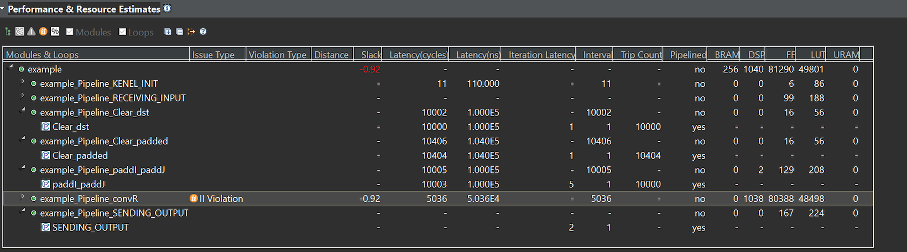
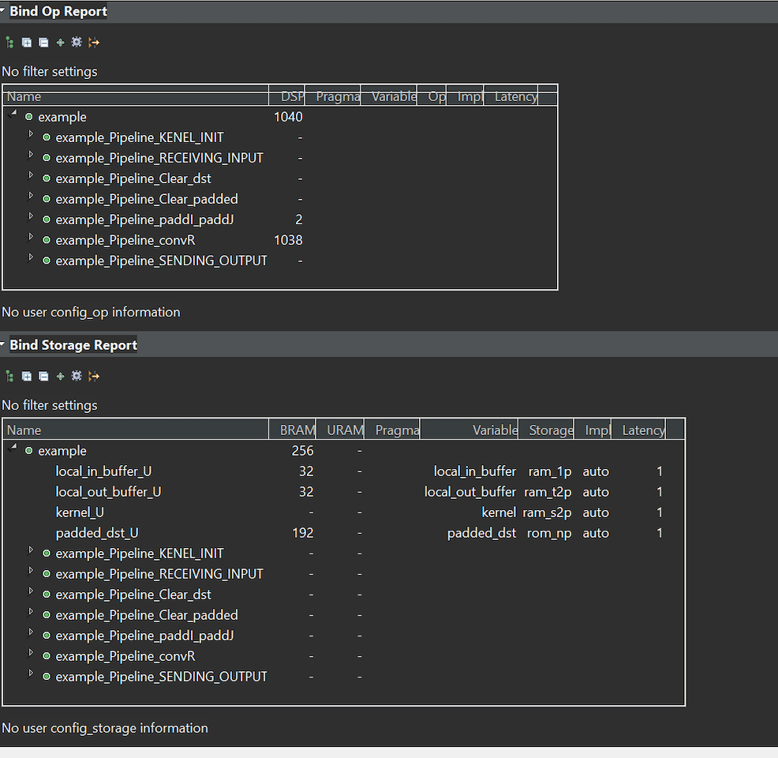

# Project 5 (15 pts) : Edge detection FPGA accelerator

## Description

In this assignment, you will develop an edge detection mechanism using FPGA. The edge detection mechanism is based on the Sobel edge algorithm. You can read the background introduction about the Sobel operator on [Wikipedia]("https://en.wikipedia.org/wiki/Sobel_operator").

The Sobel edge algorithm is built on top of a convolution function and  we are offloading convolution operations to the FPGA. The convolution operations are implemented using Vitis HLS and the rest of interface code and overlay is running on Python. 

The provided convolution operation is a basic implementation which is not scalable. Optimizing the convolution operation is your main task in this project. 

## Part-1: Improving the provided Convolution Operation (10 pts)

example.cpp is a naive CNN implemenation. Due to the navie implemenation only 30x30 size can fit into the zynq board. Your job is to optimize the code so that a large image can fit into the board. 

To optimize the code, understanding the HLS compiler's outcome reports are critical.

Please look at solution/Open Report (Synthesis) and Solution/Open Schedule Viewer to analyze the results. Please use this [Vitis HLS Manual](https://www.xilinx.com/support/documentation/sw_manuals/xilinx2019_2/ug1393-vitis-application-acceleration.pdf) and [Vitis HLS Optimization Guide](https://docs.xilinx.com/r/2022.1-English/ug1399-vitis-hls/Optimization-Techniques-in-Vitis-HLS) as reference. You should also checkout the following convolution tiling tutotial "https://sharc-knowledgebase.netlify.app/articles/cnn/tiling-based_convolution_for_hls".

In this design, you will optimize your code to handle bigger image sizes or faster. 

The possible options of code are:

[1] Remove copy loops 

[2] Convert the code to use tiled convolution operation.

[3] Convert the code to use line buffers: 

Please see algorithm_2D_convolution_linebuffer directory example. Complete convolution implementation based on the line buffer. Using line buffer, you can even scale up your design. Please synthesize the code and check the results. Please note that you cannot just copy the HLS example code but it is OK to implement your code based on the HLS example code. 

In you report, you should report a screenshot of latency table and the total latency (sum of the latency) . 
You should also show BRAM and DSP unit usage for your designs.   

Draw three charts (y-axis: total latency, BRAM usage, DSP usage), x-axis different designs. 

* Grading Policy * 
(10 pts) : improves performance and supports scalalbe image  
(8 pts) : improves performance or support scalable image

Please note that part-1 does not require for you to run the code on pynq boards. 

## Part-2 Produce Bit-stream and running it on Pynq boards (5 pts)

In this step you will use Vitis and Vivado to build the FPGA block diagram as you did in project #4.
This Sobel accelerator uses DMA to transfer images between CPU and the FPGA, so you need to use a different interconnect. Please refer to DMA instructions provided in the DMA directory for instructions on how to set up DMA.

Now, we provide two different notebooks to test your vitis design. 

* To synthesize the file you need to reduce TEST_IMAGE_ROW/TEST_IMAGE_COL/TEST_IMAGE_SIZe as 30,30, 900.  (make it run 100,100,10000) 
cv_edge_arm.ipynb and cv_edge_fpga.ipynb. 

cv_edge_arm performs sobel edge detection using ARM processors. 
Every operations are performed using python code. 
In cv_edge_fpga, convolution operations are offloaded to FPGA. 

The provided jupyternotebook code is a minimum code to start. It requires for you to update to take new filter values. 

* Grading Policy* 
(5 pts): complete the design and demonstrate the edge detection 
(3 pts): see gray/solid box 
(2 pt): Be able to synthesize and produce bit streams (doesn't run on jupyter notebook) 

## What to submit
 
[1] project5_report.pdf: Max 3 pages (including all figures) describing the designs you have tried. 
[2] bit stream of the best performing design & tcl & hwh 
[3] source code of your example.cpp 
[4] Vivado project (please include the source code) 
[5] A screenshot of the notebook jupyter included in the report. 

*FAQ* 

*[Q]: Where can I find the compiler's optimization results? 

*[A]: It's shown on console window or go to your vitis directory and under solution1, you will see solution1.log 

*[Q]: what should I discuss in the report? 

*[A]: Discuss what optimizations you did and how the latency has been changed. 
