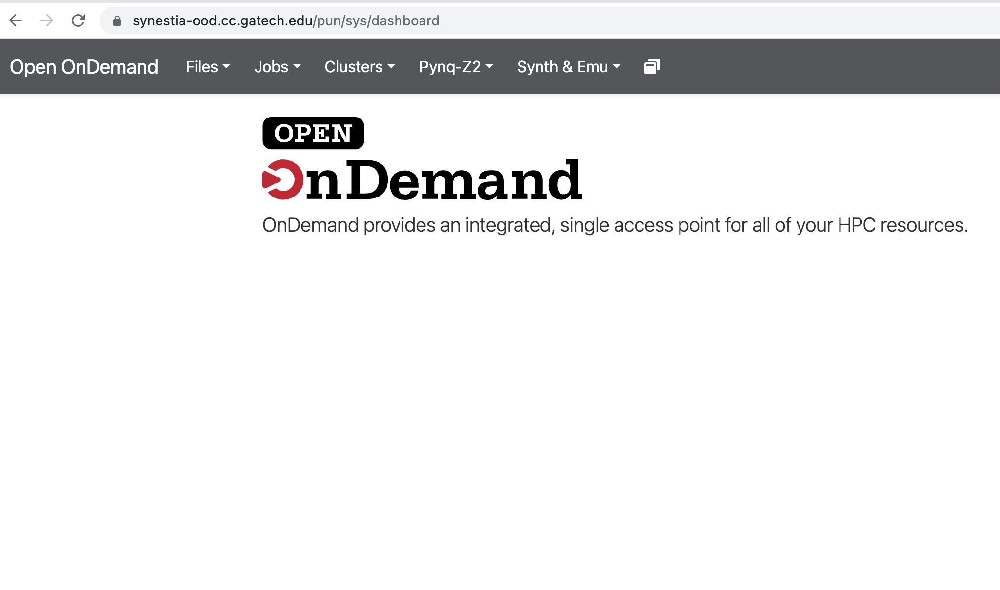
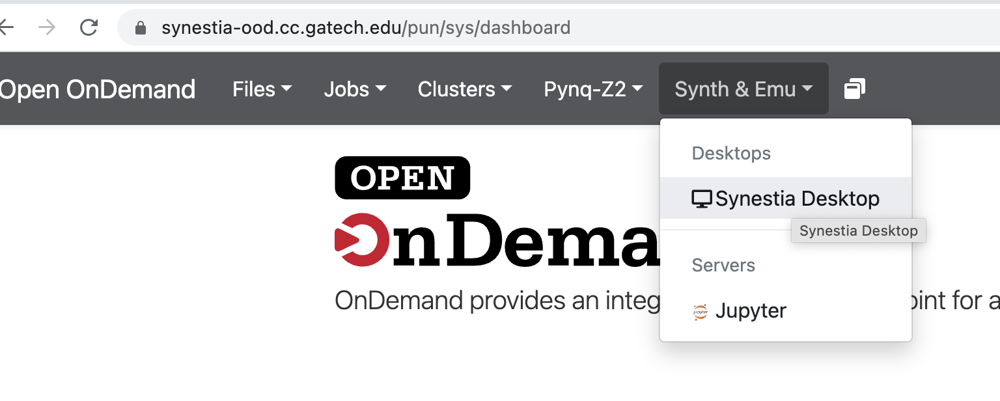
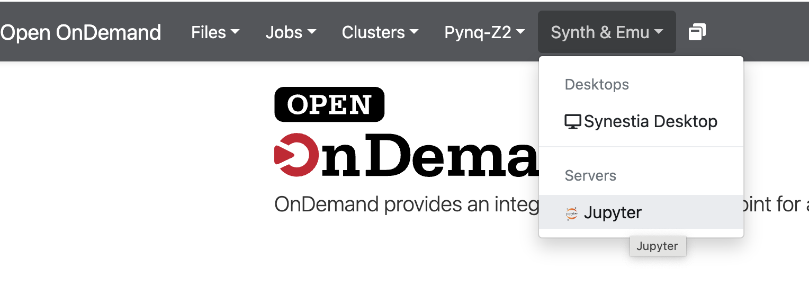
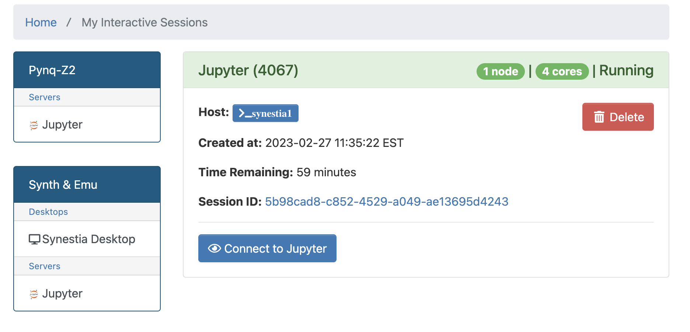
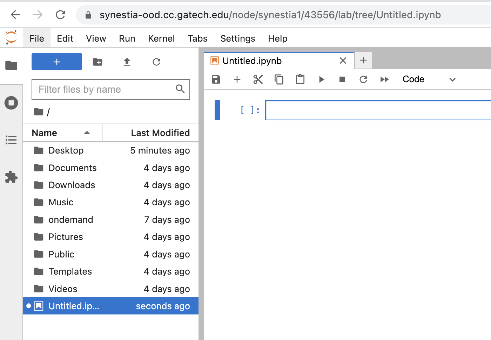

# Using Slurm and Open OnDemand

The Synestia virtual machine (VM) and Pynq board cluster currently contains the following nodes:

- 16 VMs with GUI and command-line access to Vivado tools
  - Each VM should have 4 vCPUs and 12 GB of DRAM
  - If you need more RAM, ICE may be a better option for larger simulations
  - Slurm scheduled
- 64 Pynq Z2 FPGA boards
  - Each board has 2 CPU cores, an FPGA, and 8 GB of DRAM
  - Slurm scheduled

We use the [Slurm scheduler](https://slurm.schedmd.com/overview.html) to provide access to the VMs and Pynq boards, and we have recently added [Open OnDemand](https://openondemand.org/), which provides web support for running Slurm jobs, terminal access, and Jupyter notebooks.

## To access a command-line terminal on Synestia VMs with Slurm

You need to first be connected to the [Georgia Tech VPN using GlobalProtect](https://docs.pace.gatech.edu/gettingStarted/vpn/), and then open a terminal or VSCode session. 

1) SSH to the main login node `synestia2.cc.gatech.edu` with your GT username and password.
     - NOTE: Do not run any Vivado commands on this node! Admins will have the power to kill any jobs that are not scheduling jobs.
3) Request a new interactive job on a specific node. 

```
## Get a node allocation for one node, with two CPU cores, for one hour
$ salloc -p synestia  --nodes=1 --ntasks-per-node=2 --time=01:00:00
salloc: Granted job allocation 4063
## Use squeue to see your job and how long it has run
gburdell@synestia2:~$ squeue
        JOBID PARTITION     NAME     USER ST       TIME  NODES NODELIST(REASON)
        4063  synestia interact  gburdell  R       0:08      1 synestia1
## Use srun to ssh to your allocated node
gburdell@synestia2:~$ srun --pty bash -i
## Then you can run any Vivado commands here
gburdell@synestia1:~$
```

When you are finished, you can type `exit` which will relinquish your job:

```
gburdell@synestia1:~$ exit      
exit
salloc: Relinquishing job allocation 4063
salloc: Job allocation 4063 has been revoked.
```


## Using Open OnDemand (OOD)

With Open OnDemand, you can request a command-line terminal, a VNC GUI session, or a notebook running on the VM or on the Pynq boards.

### Logging in to OOD

You need to first be connected to the [Georgia Tech VPN using GlobalProtect](https://docs.pace.gatech.edu/gettingStarted/vpn/) and then open a web browser and go to `synestia-ood.cc.gatech.edu`. You will need to use your GT username and password to log in, and you will be asked to use Duo 2FA if you have that enabled for your account.

Once you have logged in, you should see this screen with options for both the Pynq board cluster and for the Synestia VMs `(Synth and Emu)`.



### VNC GUI Session with OOD



### Jupyter Notebook with OOD







### References:

* [CRNCH references for using Slurm on other Rogues Gallery resources](https://gt-crnch-rg.readthedocs.io/en/main/general/using-slurm-examples.html)
* [PACE's guide to using Slurm on the Phoenix cluster (available on ICE in Fall 2023)](https://docs.pace.gatech.edu/training/img/Phoenix%20Slurm%20Orientation%20v5.pdf)
* [PACE's documentation for using Open OnDemand (available on ICE in Fall 2023)](https://docs.pace.gatech.edu/ood/guide/)

#### Deeper Dive

This is more for your information and not a requirement!
* [YouTube - Introduction to Slurm (Part 3)](https://youtu.be/MI9jHavOt5o) - short videos from the official Slurm playlist if you'd like to dig deeper on how to use Slurm. 
* [YouTube - Introduction to Slurm (Part 4)](https://youtu.be/aljhVYwyAoM) - short videos from the official Slurm playlist if you'd like to dig deeper on how to use Slurm.  
