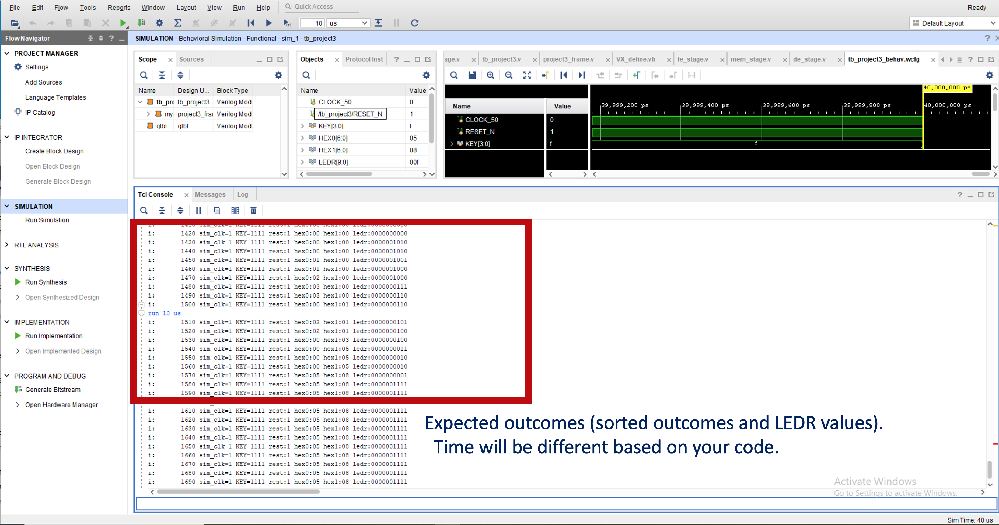

# CS3220 Assignment #3: Pipeline Design 

**Due dates**: 

**Part 1**  : 3/5/201 (F) 6 pm  ( 13.333  points)

**Part 2** : 3/19/2021 (F) 6 pm  (13.333 points)

**Part 3** : 4/2/2021 (F) 6 pm  (13.333 points)

Total:  40 points of out of the total grade. 


This is a two-member group project. Please discuss this with the instructor if you do not have a partner. 

## Part 1 : pass 5 test cases 


**Description**:

In this assignment, you will design a pipelined processor using verilog. 

For part #1, you need to pass 5 tests we create. You can locate those test files under tests directory. You can refer to the README file under tests for more information about each test case. 

You do not implement forwarding in this assignment. Your program should run with test[1-5].mem file.  

If your design does not show the correct outcome, you will not get any credit. 

You should test your design with synthesization and implementation before submission. If your design can't be synthesized or can't pass implementation, 
you have to fix your design to comply with that. 
 

**What to submit. (See Piazza @112 for reference)**:

**[1] A zip file of your source code. The zip file must contain the following:**

* agex_stage.v
* de_stage.v
* fe_stage.v
* mem_stage.v
* wb_stage.v
* project3_frame.v
* VX_define.vh

**[2] A zip file of your Vivado project directory. Please see Piazza @112.**


**[3] A Report PDF file that contains 6 images (Test1-5 and synthesis+implementation). Please see sample report on Piazza @112 and follow the same format. You do not need to write anything just paste clear screenshots. Note: screenshots must be clear and file must be PDF.**

You and your partner should submit the same version of the zip file.

Please make it sure your code is running and passing test[1-5]

Each student must submit a report. You and your partner can submit the same report (just make sure your names are in the report)

Grading: 
If your design does not pass synthesis and implementation, you will get only 50% of your score. 
 

***Please do not procrastinate.*** 


## Part 2: Complete the pipeline  

**Description**: 

In this part, you will complete the entire ISA. Your program should run with testall.mem case we provide. You don't need to implement data forwarding in this part.


**Grading**:

It should pass testall.mem file in behavior simulation and the design should pass synthesization/implementation.  
If the design pass the behavioral simulation test but it cannot be synthesized, you will get only 50% of the scores. 

If it does not pass testall.mem file, then there is no partial grading. Only for this assignment, we will accept a late submission with a penalty. 
Late submission: If you can submit the successful design  by the due of part-3, you will receive 50% of the part-2 score. 


 

**What to submit**:

[1] project3.zip (including testall.mem and all other files).

You and your partner should submit the same version of the zip file.


[2] Report: You must submit your **own version** of your report. (**Report.pdf**) Please submit a pdf file. Do not include the pdf file in a zip file. You should write a report independently (your partner will write his/her own report) and submit it. The report should include

​     \- Design options and approaches that you have taken

​     \- Problems/issues and how you solved

​     \- Pipeline design diagram. These diagrams can be shared with your partner. (any modifications from assignment #1?, part #1. you can use the same diagram if you haven't changed. ) 

​     \- Contribution to the project.: What you have done and what percentage your contribution is.

Your report might be 1 page excluding diagrams.


## Part 3:  write bubble sort assembly code. 

**Description:** 

In this design, you will write a bubble sort that similar to what you did in assignment #2 in the assembly code. 
Data should be stored in address 0x040.  The filename needs to be bubblesort.asm 
mem[0x040] = 0x0010 
mem[0x044] = 0x0050 
mem[0x048] = 0x0012
mem[0x04c] = 0x0003
mem[0x050] = 0x0002
mem[0x054] = 0x0001
mem[0x058] = 0x0030 
mem[0x05c] = 0x0050
mem[0x060] = 0x0085   

After the bubble sort is done, iterate the sorted array once and display the sorted value in the memory in HEX0,HEX1 and the loop count (backward loop count) in LEDR. Once the final loop iteration to read the value 
is over, put 1F on LEDR.  
once that's finished, please put the following statement in the assembly code so that the code is in an infinite loop. 
```
DONE: 
   br DONE; 
``` 

please also modify *tb_project3.v* to print out HEX0, HEX1, LEDR more frequently so that the TclConsole shows the all the loop iterations. 

Here is an example of the output. 



**what to submit**
[1] Report.pdf: 
Show the screenshots of your simulation to show that memory sort is completed.
[2] bubblesort.asm
[3] assginment3.zip that includes bubblesort.mem 
[4] xilinix project folder  

FAQ)
Q1. How to generate mem file ?
A1. Use [assembler.py](https://github.com/gt-cs3220-spr21/gt-cs3220-spr21.github.io/blob/master/assignment3_files/assignment3_frame/test/assembler.py) to convert your assembly code into mif file format. And then use [miftomem.py](https://github.com/gt-cs3220-spr21/gt-cs3220-spr21.github.io/blob/master/assignment3_files/assignment3_frame/test/miftomem.py)  to generate bubblesort.mem
Note:
testall.mem do not cover all corner cases. You might need to debug your hardware as well.

**Few tips**
1) ADDI,ANDI, ORI, XORI,  the destination register argument is in the second, unlike the rest of ALU operations.
e.g.) ADDI S2, A0, 4 ;  A0 = S2+4
On the other hand ADD, S2, A0, A1 ; S2 = A0 + A1
2) Please do not use R10 for registers since JMP uses R10.
3) When you access the data, please increment the memory addresses by 4 since the data is word-aligned.
4) Assembler is the minimum job of generating an assembly code. Please review the code to check for any syntax errors.


## Optional task: Adding a branch predictor 

** Description ** 

In this design, you would add a branch predictor using a 16-entry gshare branch predictor (i.e. 4-bit branch history length). 
If your design works correctly with a branch predictor, you will get a 5 extra point. Your branch predictor should work with your bubble sort. 
