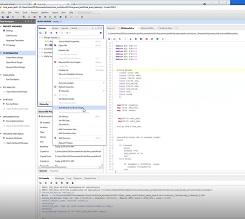
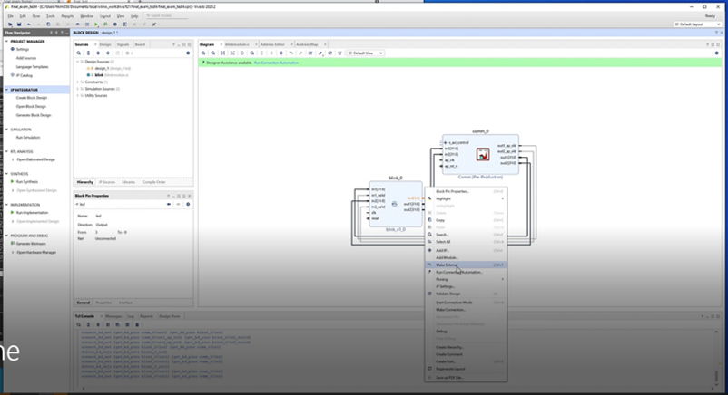
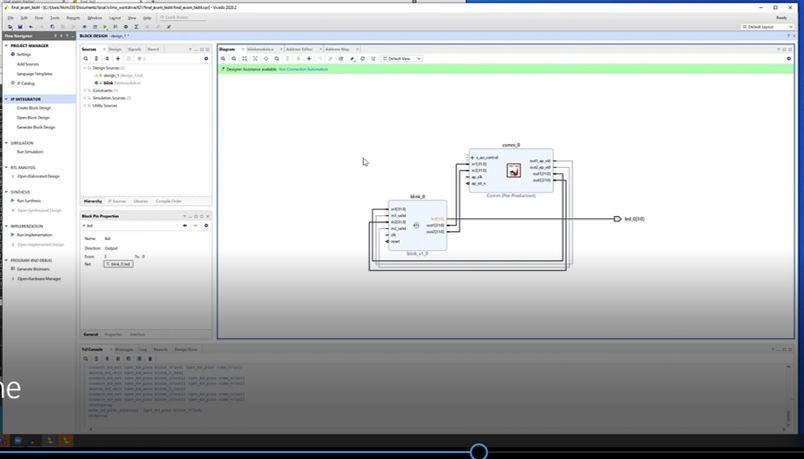
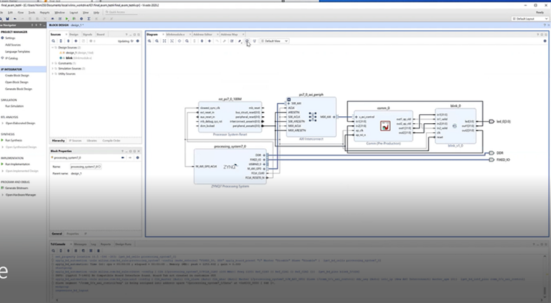
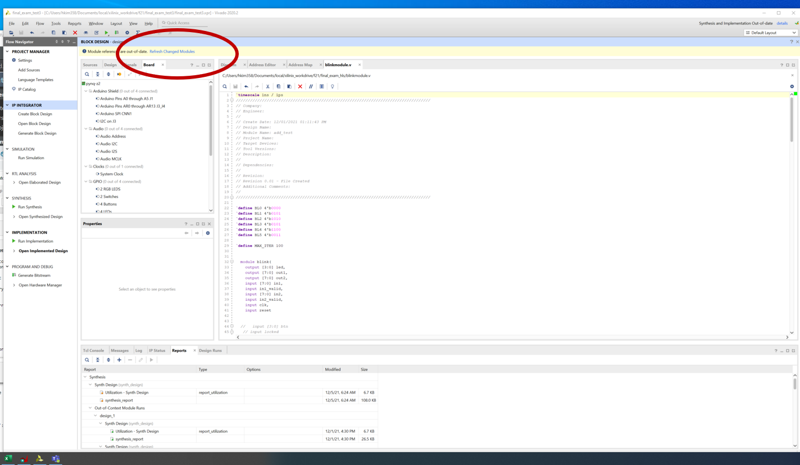

*Final Exam Frame*

This frame is to connect verilog modules with pynq overlay frame so that verilog modules can interact with ARM Processor. We are using memory-mapped interface between PL and PS using AXI-lite protocol. 

*[Step-1-vitis]*
Create a comm IP from vitis. All steps are the same as HW #9. 
This vitis code doesn't have any contents other than having ports (inputs and output arguments)  to verilog modules with memory-mapped connection using AXI lite protocol.  So you can consider this vitis code as an AXI-Lite adopter, and luckily vitis generates all the necessary code for us. 

*[Step-2-Vivado]* 

[1] Create a vivado  new project with adding blinkmodule.v and PYNQ-Z2 xdc file. (Please note that xdc file is modified to work with this frame so please use this one. 

[2] Create a block design, IP repo setting to import RTO from step-1, and add comm IP a block diagram. 

[3] Add blinkmodule to block diagram. 

 

[4] Connect blinkmodule and comm module (in1 <-> out1, in2 <->out2, etc.) manually. 

[5] Make LED as an external component 

 

[6] The diagram should look like following. 
 

[7] Add Zynq PS module from IP repo and then use auto-connect features to complete all the connections.  If clock or reset connections are missing, you can connect them manually. 

[8]Create HDL wrapper go to “sources” and right click on your block design name, click on “Create HLD wrapper”. Click on “Let Vivado do” option and press “OK”.  Make the design_wrapper as a *top module* by right clock in the source code "Set as Top". 

[9] Synthesize/implementation/generate bitstreams

[10] Click on Project->Generate Bitstream (it will ask to synthesize etc. and click yes)

[11] Click on File->Export-> Export block design, select the option of including bitstream

[12] Copy files to prepare for upload them to pynq boards 

copy bit stream file .bit
.runs/impl_1/design_1_wrapper.bit 
copy tcl script file .tcl .runs/impl_1/design_1_wrapper.tcl
copy hwh file . .gen/sources_1/bd/design_1/hw_handoff   hwh file.

make sure name all the same file name (e.g. blink.*) 

[16] Go to pynq boards and upload the files that are generated in the above step and also ipynb files.  start final_test_ipyb 

[17] You can vary write (0x10, 0x18) addresses which are two input addresses and read 0x30 and 0x20 output. LED should be blinking if bitstream is correctly running 

[18] Try to vary blink patterns. 
If you modify verilog code, you will see "Refresh changed Modules". Please click, then the verilog code update will be propagated. You need to repeat from step 9 to test the new bitstream. 

 

