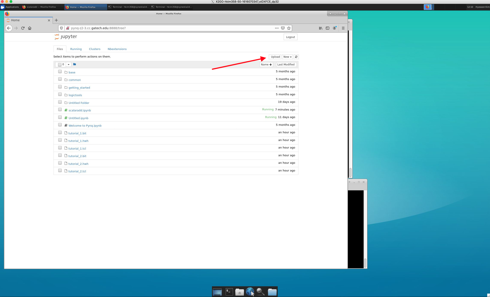
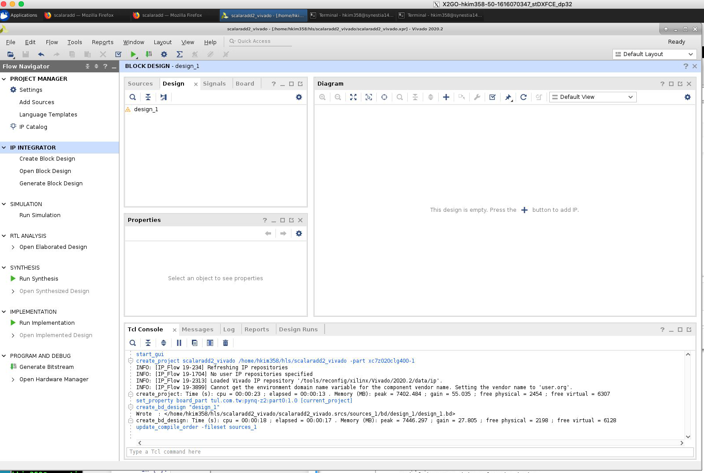

#HW 10# 

**(Due: 11/3/21) 6pm**


# Part 0 # Set up the ARM processor on Pynq 

In this assignments, you will learn using pynq (Python productivity for Zynq (PYNQ)).  

Please set up [Pynq board first.](https://pynq.readthedocs.io/en/v2.3/getting_started/pynq_z2_setup.html) 

Use the following [image] (https://dpoauwgwqsy2x.cloudfront.net/Download/pynq_z2_v2.6.0.zip)  to create a boot image for the pynq-z2 SD card.  
You need to ```dd``` the boot image. 
If you are using Mac this [tool](ttps://www.balena.io/etcher/
)  can be good.  You can use other tools. 


Please read the [PYNQ Getting Started docs](https://pynq.readthedocs.io/en/v2.5.1/index.html) and also set up the pynq board. 
You should be able to connect your pynq board with your IP of the pynq board from web browser before you proceed part-1.

**Task** 

In this assignment, you will create a bitstream from vivado and generate overlay so that it can run in the jupyter notebook. 

## Part 1 : Follow the overlay tutorial with providied bistream  

This instruction is based on [this tutorial](https://pynq.readthedocs.io/en/v2.0/overlay_design_methodology/overlay_tutorial.html). 
The tutorial file is copied from this repo: https://github.com/PeterOgden/overlay_tutorial.git 

### Steps 
[step 1] Check out hw10_files from the class git

[step 2] Start jupyternotebook

[step 3] Upload files to pynq board's ARM processor  
(scalaradd.ipynb, tutorial_1.bit) 



[step 4] Start a terminal on jupyternotebook : this terminal is running on the board's ARM processor  


```
#Copy the tutorial bitstream and HWH file to the main directory
root@pynq-z2-3:/home/xilinx# cp jupyter_notebooks/tutorial_1.* /home/xilinx/. 
```

[step 5] Open scalaradd.ipynb in jupyternotebook 
 
Press the run button for each cell and see whether it works or not. 


## Part 2 
Extend the tutorial to load your own bitstream design. 

**Step-Vitis: Open Vitis HLS and generate ip**


**Start Vitis HLS program (similar to HW#9)** 

[1] Click on “Create New Project” in the very first page.

[2] Specify the “Project name” and “location” of the project

[3] Click on “Add Files…” to add “<file_name>.cpp” and “<file_name>.h”. Do not add the test file yet.

[4] In the same window, click on Browse, to choose the top function (you can add it later).

[5] In the next window, click on “Add Files…” to add “test_<file_name>.cpp”, which is our testbench.

[6] In the next window, you can leave Solution Name and Period as it is, and just click on “…” to choose **pynq** boards. Then click “Finish”.

[7] Then, your project is opened. You can see the files in the left. 

[8] If you haven't added top module, open "project settings" and click "Synthesis" and add top module "add" in this example as top function. 

[9] To test the project, you can first “Run C Simulation” (you can find it under Project tab, or in the shortcuts). Once you click on that, a window appears, in which you may choose “Launch Debugger”, if you want to debug your code. Otherwise, you can just click on “OK” to run.

[10] "solution"->"Run C Synthesis" ->"C-synthesis"

[11] "solution"->"Export RTL"   

[12] Copy AXI data register ids for inteface on the later step. The location for these IDs is in <project_name>/solution1/impl/ip/drivers/<module_name*>/src/<module_name>_hw.h

[13] Copy the data range somewhere to match with pynq boards. Please see below image as example of what data range we are talking about here. 

##define  _ADDR_*_DATA addresses 

 


## Step-Vivado:Open Vivado and import IP and generate Bitstream

### Start Vivado application 

[1] Create new project, select RTL project and then select pynq-z2 or pynq-z1 for your board. (you don't need to add any new files and just select default options)

[2] Click on the "IP Integrator/Create Block design," use default name "design_1", do "OK"



[3] Project setting -> IP -> IP Repository -> Add the directory from the step-Vitis. 

```<project_name>/solution1/impl/ip```


[4] On the block design windiw, add our HLS IP module (e.g., add in hw #10), add Zynq Processing system 


 

[5] Click on the "Run block automation" and "Run connection automation"


[6] Go to "sources" and right click on your block design name, click on "Create HLD wrapper". Click on "Let Vivado do" option and press "OK". 


[7] Click on Project -> Generate Bitstream (it will ask to synthesize etc. and click yes) 


[8] Click on File->Export-> Export block design, select the option of including bitstream 

 


[8.a] Copy bit stream file  .bit 
<project_name>.runs/impl_1/design_1_wrapper.bit 


[8.b] Copy tcl script file .tcl
<project_name>.runs/impl_1/design_1_wrapper.tcl 

[9] Copy hwh file 
. <project_name>.gen/sources_1/bd/design_1/hw_handoff
you can find hwh file. 

[10] Make all files in the same names (e.g. add.bit, add.tcl, add.hwh) and place where they are easy to find  

[11] Upload the three files (add.hwh, add.tcl, add.bit) into pynq boards (as you did in Part 1)

[12] Repeat part-1 using jupyter-notebook with myadd.ipynb file   


## (Optional task) Part 3 Convert the add example to take 3 inputs and change the name of module to add3

**IMP Note: Please create new Vitis HLS project and new Vivado project for part 3**

In Part 2 you created an addition IP that used 2 ports (a & b). For Part 3, you need to modify add.cpp and adder.h to make it into 3 port IP. So inputs will be a,b,c and output will be d.

```d = a + b + c```

Name of module is add3.

Overview of general steps we follow:

Step [1] Open Vitis HLS and generate ip 

Step [2] Open Vivado: Add ip and PS and generate bitstream, metafiles  

Step [3] Copy the bitstream of add3 into jupyter (pynq boards) 


Useful github links: 

PYNQ repo : https://github.com/Xilinx/PYNQ

Overlay tutorial code:  [https://github.com/PeterOgden/overlay_tutorial]


**What to submit**: Please answer the question in hw#10 in canvas. 

**In order to do project #4, hw#10 needs to be completed first. Please finish it ASAP. 

