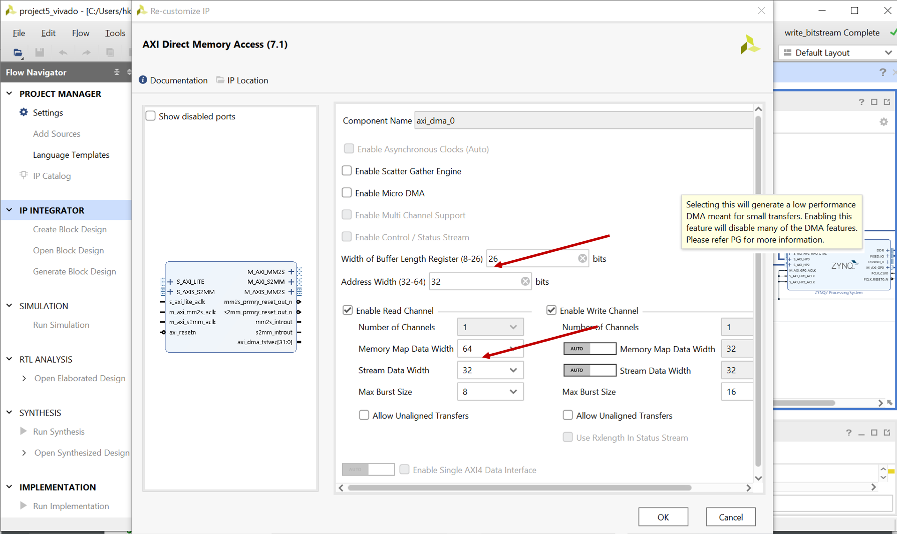
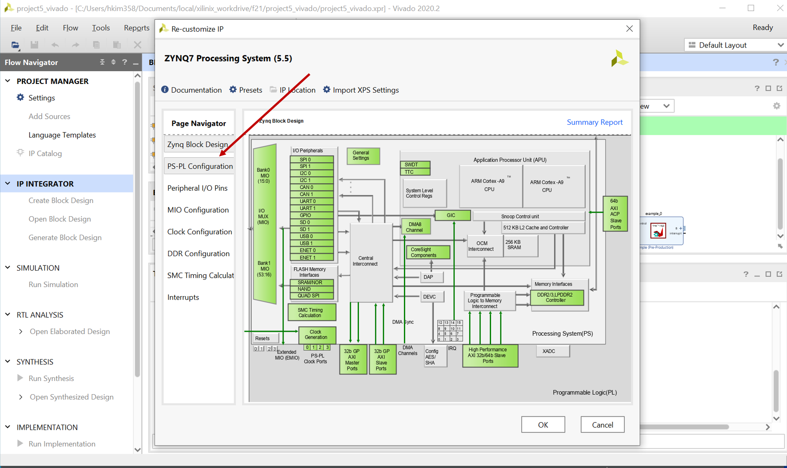
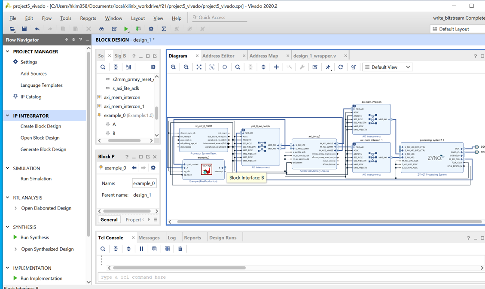

HW #12 Assignments 

(Due : 12/1/21 W  **6:00 pm EST**)

In this assignment, we provide a simple AXI-stream based accelerator that adds input source value + 5 and writes the results. This is a simple accelerator mainly to test whether we can access the memory contents from our accelerator. 

Please also look at  <a href="https://discuss.pynq.io/t/tutorial-pynq-dma-part-1-hardware-design/3133">the DMA tutorial </a> for more information. Instead of FIFO-stream in the tutorial, we are using our own IP (example).   

**What to do:** 
[part-1] Vitis to RTL generation. 
The same way we did in project #4 (or hw10 part-2 description), you produce an RTL design using hw12_files/example.cpp  

[part-2] Vivado to RTL 

This step is similar to  project #4 but there are more settings in the IP and more modules need to be connected. 
The following steps, please also look at hw#10's description. The part that was already discussed in hw10's procedure is only shown as a simple keyword 

[1] Create new project   

[2] Create block design 

[3] Add  IP module into IP repository 

[4] Add DMA IP module in the open block design. 

[5]  and configure the DMA. 

* You need to double clock the DMA to open the configuration settins. 
* Uncheck Enable Scatter Gather Engine to disable Scatter Gather
* Set the Width of Buffer Length Register to 26 (optional)
* **Set the memory mapped data width to 64 match the HP port (defined in the PYNQ image and applied at boot time)** 

[6] add "Zynq PS" IP module and then configure it. 

* Double click the Zynq PS block to open the customization settings
* Go to the PS-PL Configuration

* expand HP Slave AXI Interface and enable S AXI HP0 and S AXI HP2 interface

[7] click on the “Run block automation” and “Run connection automation” 

 

[8] If HP ports are gone (the circle ports in the above figure. e.g.) S_AXI_HP0 etc.), repeat step 6 and make it sure HP ports are visible. 

Select S_AXI_HP0 and for the Master Interface select /dma/M_AXI_MM2S
Select S_AXI_HP2 and this time select /dma/M_AXI_S2MM for the Master Interface

if you don't see S_AXI_HP0 and S_AXI_HP2 pop-up window, you need to report the setp 6. 

[9] Add "example" IP of your design to block design using "+" button 

[10] run autoconnection. 
when you see the "run connection automation box"

DMA: M\_AXIS\_MM2S → example\_0:A

DMA: S\_AXIS\_S2MM → example\_0:B

[11] F6 (or press a check box) to validate your design. 
If there is an error, some steps are wrong so please review your design with the provided steps carefully. 
Your design should look like this 

[12]  Create HDL wrapper 
go to “sources” and right click on your block design name, click on “Create HLD wrapper”. Click on “Let Vivado do” option and press “OK”.

[13] Click on Project->Generate Bitstream (it will ask to synthesize etc. and click yes)

[14] Click on File->Export-> Export block design, select the option of including bitstream

[15] copy files to prepare for upload them to pynq boards 

copy bit stream file .bit
.runs/impl_1/design_1_wrapper.bit 
copy tcl script file .tcl .runs/impl_1/design_1_wrapper.tcl
copy hwh file . .gen/sources_1/bd/design_1/hw_handoff   hwh file.

make it sure name all the same file name. 

[16] Go to pynq boards and upload the files that are generated in the above step and also ipynb files. 
execute dma_basic_test.ipynb 

[17] check whether you are receiving the output buffer that is the input buffer value  + 5. 
change the data_size to 1000, 1000000 and write down exec_time. Compute the bandwidth. 
Please note that int32 is 4B and this transaction is bi-directional (send and receive). 

[18] go to Canvas and answer HW#12 quiz questions. 

**What to submit** 

No submission  other than answering HW#12 questions  at canvas 

**FAQ** 

[Q] During the design validation, I receive the errors. what should I do? 
[A] If you miss one of the options, it's very easy to get the errors. Pleaes review the steps carefully and repeat the procedure. 

[Q] I run the code in the jupyter notebook, but my output buffer is empty? 
[A] This means the example module and DMA module is not communicating. It's more likly you did not enable zynq HP ports or did not follow DMA setup options correctly. Please review the steps and regenerate the bitstreams. Having a wrong options doesn't prevent from generating bitstreams so having a bitstream doesn't mean your design is correct. 

[Q] Do I need to load bit stream again when I change the data_size? 
[A] No, but you need to set "example.write(0,1) " and you need to make it sure "example.read(0)" returns 1. If not, wait and try it again. 

[Q] What doest status_value means ? 
[A] address 0 in the example_0 address range iis for s_axi_control status_value returns status. bit 0: AP_START, bit 1: AP_dONE, bit2: AP_IDLE, bit 3:AP_READY. 
you can find this information in the 

