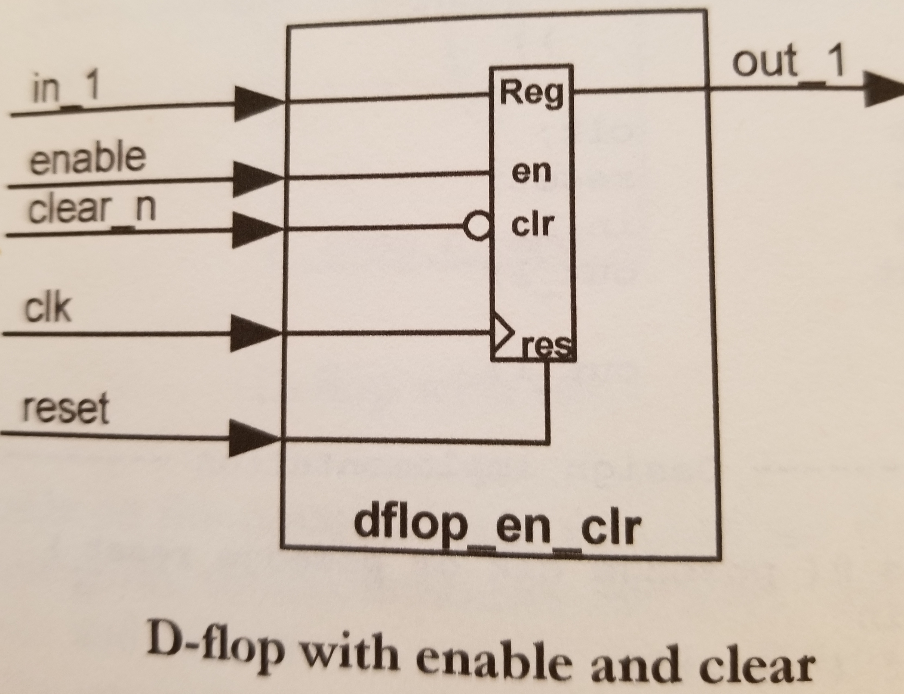
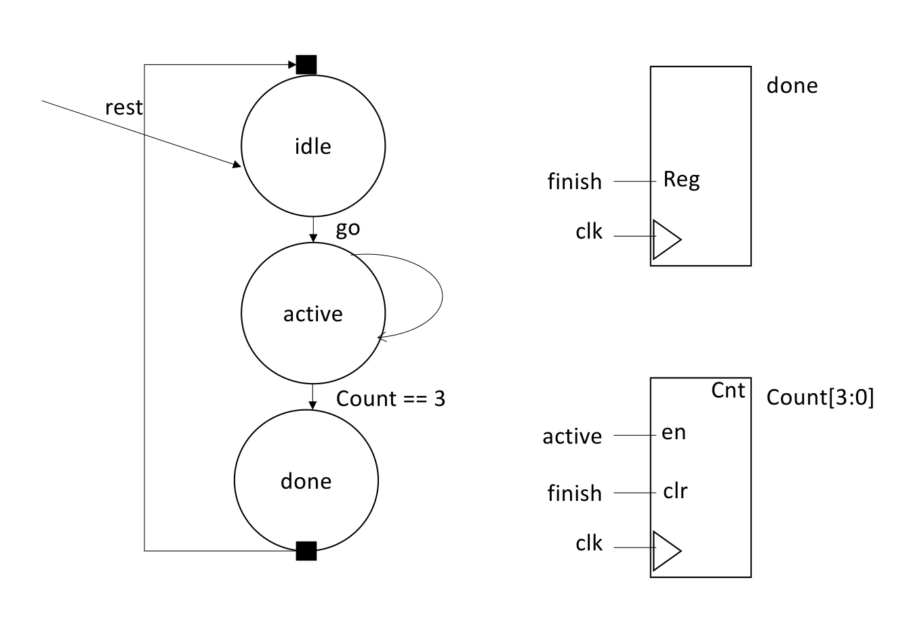

HW #2 Assignments 

(Due : 9/3/21 (F) **6:00 pm EST**)

[1 point]

In this assignments, you will advance your verilog knowledge.  

Please checkout hw2_files folder from the github. 

**What to submit**: a screenshot of task 2 and task 4.  (please use pdf or png file formats)

**Grading**: Submit a screenshot of the last tasks that you have completed. 
You will get a full credit, if you have submitted your efforts for doing the assignment. These tasks are designed to help project #1. 


 

**Task #1**: create a project with bus_example. 

Draw a bus design diagram based on bus_sigs module. 
The correct answer is bus_design.jpg (which is also shown below)


Test module has 
``` {in_3, in_2, in_1} = i[8:0];```
Answer what this statement is doing.  

(you don't need to submit the answer)

The solution diagram is in the folder. 


**Task #2**: Extend D-flop with enable and clear signal dflop.v  (dflop example folder)




Frame and testing code examples are provided. 


**Task #3**: [Optional] Complete the state machine in  simplestate.v .  (state_example folder)

Please complete the module to have a following state diagram 




A Frame and testing code are provided. 

An example code is in 4.verilog_3.pptx


**Task #4**:  Initialize the memory with test.mem (mem_example folder)

First, initialize the memory contents using ex1.mem file. 

Read the value from the memory every cycle and write a new contents (old content + 1) to the same memory location.  (only 10 elements are in the memory system)

Every cycle, the memory address is incremented.  

In this design, you are using synchronous design. 


An example code is in 4.verilog_3.pptx 

Note: The example verilog codes are mostly from "Verilog by example: a concise introduction for FPGA design" by Blaine C. Readler"

