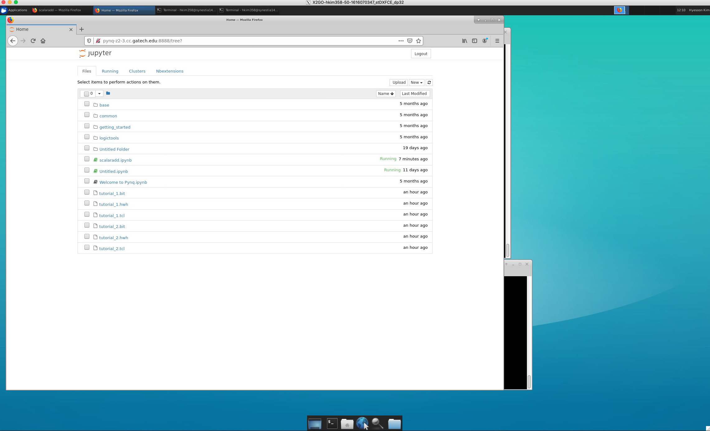
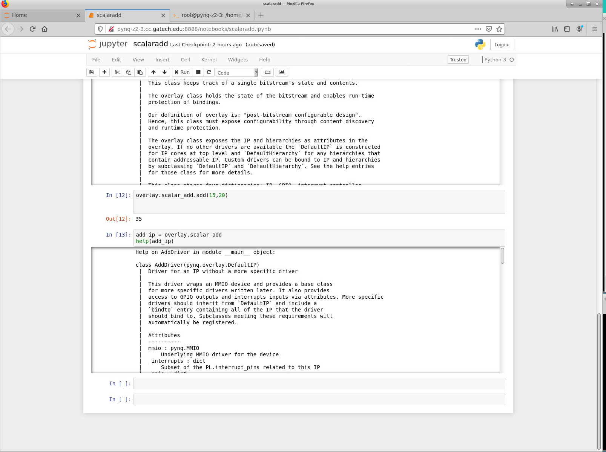
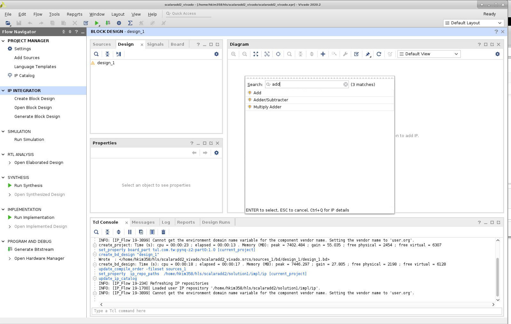

## Lab day #5 Assignments 

(Due : 4/5/21)


In this assignments, you will learn using pynq (Python productivity for Zynq (PYNQ)).  

Please read the tutorial and assignment documentations before your sign up for pynq board usuage time. 

please read the [PYNQ Getting Started docs](https://pynq.readthedocs.io/en/v2.5.1/index.html)

We already set up the pynq boards to communicate with your VMs. 

*Time sharing * 
This is a link to google doc. 
each team can have 1.5 hour slot.  


*Instruction How to open jupyter Notebook" "
1) Please login into the VM 
2) Open internet browser (eg: Firefox) 

3) Type "pynq-z2-1.cc.gatech.edu:8888/" 
replace z1-1 to z1-[1-10], z2-[1-5] depending on the boards that you are accessing. 
4) Password is on Piazza

*Task * 
In this assignment, you will create a bitstream from vivado and generate overlay so that it can run them in the jupyter notebook. 

* Part 1 * Follow the overlay tutorial with providied bistream  

This instruction is based on [this tutorial](https://pynq.readthedocs.io/en/v2.0/overlay_design_methodology/overlay_tutorial.html). /
The tutorial file is copied from this repo: https://github.com/PeterOgden/overlay_tutorial.git 

### Steps 
[step 1] check out labday5_files from the class git

[step 2] start jupyternotebook

[step 3] upload files from your VM's files to pynq board's ARM processor  


  (scalaradd.ipynb, tutorial_1.bit) 

[step 4] start a terminal on jupyternotebook : this terminal is running on the board's ARM processor  


```
#Copy the tutorial bitstream and HWH file to the main directory
oot@pynq-z2-3:/home/xilinx# cp jupyter_notebooks/tutorial_1.* /home/xilinx/. 
```

[step 5]
Open scalaradd.ipynb in jupyternotebook 
 
Press the run button for each cell and see whether it works or not. 


## Part 2 
Extend the tutorial to load your own bitstream design. 

*Step-Vitis: Open Vitis HLS and generate ip *


Start Vitis HLS program (similar to lab#4) 
1. Click on “Create New Project” in the very first page.
2. Specify the “Project name” and “location” of the project
3. Click on “Add Files…” to add “<file_name>.cpp” and “<file_name>.h”
4. In the same window, click on Browse, to choose the top function (you can add it later)
5. In the next window, click on “Add Files…” to add “test_<file_name>.cpp”, which is our testbench.
6. In the next window, you can leave Solution Name and Period as it is, and just click on “…” to choose **pynq** boards. Then click “Finish”.
7. Then, you project is opened. You can see the files in the left. 
8. if you haven't added top module, open "project settings" and  click "Synthesis" and add top module "add" in this example as top function. 
8. To test the project, you can first “Run C Simulation” (you can find it under Project tab, or in the shortcuts). Once you click on that, a window appears, in which you may choose “Launch Debugger”, if you want to debug your code. Otherwise, you can just click on “OK” to run
9. "solution"->"Run C Synthesis" ->"C-synthesis"
10. "solution"->"Export RTL"   
11. copy AXI data register ids for inteface on the later step 

open <project_name>/solution1/impl/ip/drivers/<module_name*>/src/<module_name>_hw.h 
copy the data range somehwere to match with pynq boards. 

#define  _ADDR_*_DATA addresses 

 

*Step-Vivado:Open Vivado and import IP and generate Bitstream * 
Start Vivado application 
1. Create new project, select RTL project and then select pynq-z2 or pynq-z1 for your board.  (you don't need to add any new files and just select default options) 

2. Click on the "IP Integrator/Create Block design," use default name "design_1", do "OK"


3. Project setting -> IP -> IP Repository ->Add the directory from the step-Vitis. 

```<project_name>/solution1/impl/ip```


4. on the block design windiw, add  our HLS IP module (e.g., add in lab #5) , add Zynq Processing system 




 

5. clock on the "Run block automation" and "Run connection automation"


6. go to "sources" and right click on your block design name, click on "Create HLD wrapper".  Click on "Let Vivado do" option and press "OK". 


7. Click on Project->Generate Bitstream (it will ask to synthesize etc. and click yes) 


#8. Click on File->Export-> Export block design, select the option of including bitstream 

 
the default location is 

 

copy bit stream file  .bit 
<project_name>.runs/impl_1/design_1_wrapper.bit 
tcl script 
<project_name>.runs/impl_1/design_1_wrapper.tcl 

9. copy hwh file 
. <project_name>.gen/sources_1/bd/design_1/hw_handoff
you can find hwh file. 

10.  make all files in the same names (e.g. add.bit, add.tcl. add.hwh) and place where they are easy to find  

12. upload the three files (add.hwh, add.tcl, add.bit)  into pynq boards 

13. repeaset  part-1 using jupyternotebook with myadd.ipynb file   


The example is using two inputs add. conver the add example to take 3 inputs and change the name of module as add3.

Step [1] Open Vitis HLS and generate ip 
Step [2] Open Vivado: Add ip and PS and generate bitstream, metafiles  
Step [3] copy the bitstream of add3 into jupyter (pynq boards) 


Useful github links: 
PYNQ repo : https://github.com/Xilinx/PYNQ
Overlay tutorial code:  [https://github.com/PeterOgden/overlay_tutorial]


**What to submit**: a screenshot of  jupyter notebook. 

You can share the same screenshot as your term project partner. 

**Grading**: Submit a screenshot of the last tasks that you have completed. 

We won't grade the correctness of tasks. However, we strongly encourage you to complete tasks and ask TAs/instructors during the lab day lecture hours if you face any problems.  


