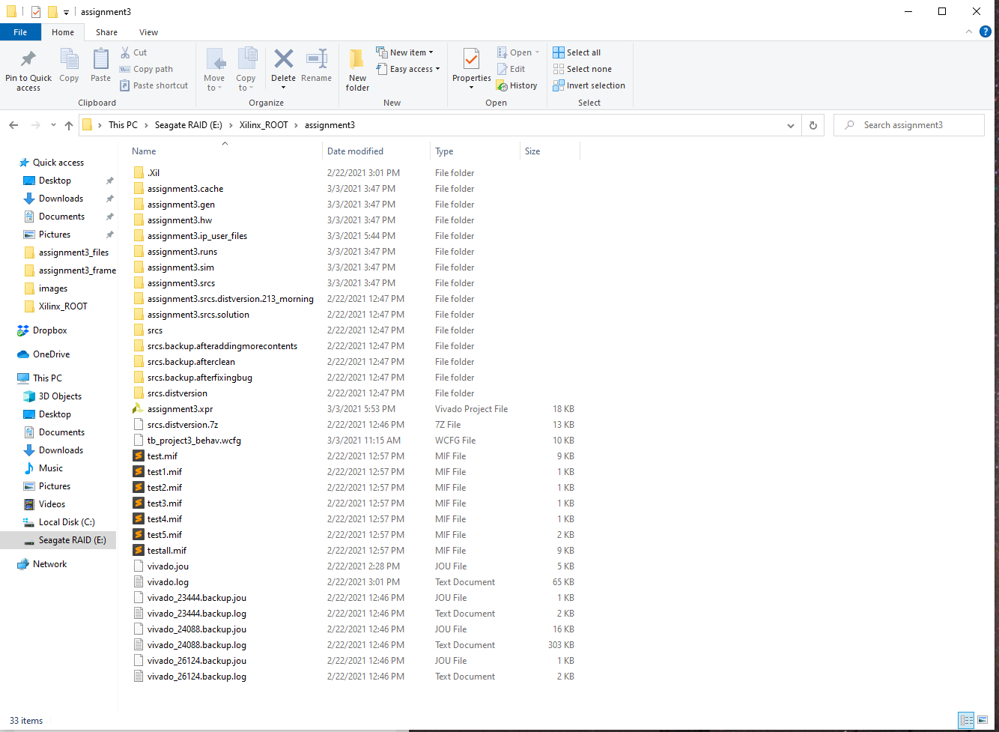

# CS3220 Assignment #2: Pipeline Design 

**Due dates**: 

**Part 1**: 9/25/2021 (F) 6 pm  (5 pts)

**Part 2**: 10/8/2021 (F) 6 pm  (10 points)

This is a two-member group project. 


**Description**:
In this assignment, you will design a pipelined processor using
verilog. In part-1, we will evaluate your assignments with only
behavioral simulation. In part-2, we plan to ask you to synthesize the
code and run on Pynq boardsm so please avoid using any high-level c-style code like for loops. 

## Part 1 : pass 5 test cases 
For part #1, you will implement a subset of pipeline. You  only need to pass 5 tests we create. Please see the test cases for the part-1 requirements. You can locate those test files under tests directory. You can refer to the README file under tests for more information about each test case. 

You do not need to implement forwarding in this assignment. Your program should run with test[1-5].mem file.  


**Grading**: 
Grading scheme: 

if pass test5: 5 pts 
else if you pass test[1-4]: 3 pts 
else if you pass any of test[1-4]: 2 pts 

**Late submission**: 
If you finish part-2 on time w/o correctly finishing part-1, you will
still get 2 pts for part-1. 


***Please do not procrastinate.*** 

## Part 2: Complete the pipeline  

**Description**: 
In this part, you will complete the entire ISA. Your program should
run with testall2.mem case we provide. You don't need to implement
data forwarding in this part.  We will provide the instruction how to
test your pipeline in the pynq board soon. 


**What to submit**:
**[1] A zip file of your source code. The zip file must contain the following:**

* agex_stage.v
* de_stage.v
* fe_stage.v
* mem_stage.v
* wb_stage.v
* project3_frame.v
* VX_define.vh

**[2] A zip file of your Vivado project directory. **


**FAQ)**

Q) How do I run a specific test file? 
A) Please see "VX_define.vh" line 22.
 // [NOTICE] please note that both imem and dmem use the SAME "IDMEMINITFILE".
  // you need to change this line to change which test file to read 
  `define IDMEMINITFILE  "test1.mem"
 
You need to change "test1.mem" into "test2.mem" etc. 


(Q) Can I add a new verilog file? 
(A) please try not to do that. It will break our autograder script. 


Q) How to generate mem file ?

A) Use [assembler.py] to convert your assembly code into mif file format. And then use [miftomem.py].

Note:
testall2.mem do not cover all corner cases.


Q)Do we need to create a stack for nested JAL instructions? 
A) The hardware does not know any nested calls. so you do not need to implement it. 


Q) Br r1, r2, imm : if a branch is taken, is the new PC = PC + imm or new PC = PC + 4+ imm? 
A) The answer is new PC = PC + 4 + 4 * 4 sxt (imm)


Q) How to insert a bubble in the pipeline?
A) You could have a valid bit for each pipeline latch to indicate
whether the contents in the latch is valid or not. Or you could insert
zeros to all latch contents. This is your implementation decision.

Q) How can send write signal from WB to Decode stage? We are trying to
implement the LW instruction.  We're using from_WB_to_DE to send a write signal from WB to Decode to write to a register. We want to use one of the bits as the write signal, but we don't know how to set it only when the WB stage has a LW instruction. How do we set a bit in from_WB_to_DE only during the LW instruction?

A) 
You have three options
[1] you generate those signals at the decode stage and carry over the signal from the decode stage to exe, mem, and writeback stage.
[2] writeback stage still has inst_wb, so you could decode instruction
again at the write back stage and generate control signals.
[3] you can add opcodes in the de/exe/mem latches and pass the opcode until the WB stage and generate the necessary control signal at the write back stage.


Q)What do wr_reg_DE and its variations mean? What are they used for?

A) That's a place holder to pass the write register control signal
that is generated from DE stage based on an instruction in the decode
stage and carry over the value until the WB stage. You don't have to use all the wires/variables in the frame.
You are free to add new ones as you need.

Q) Do the LW and SW instructions have any dependencies in test1.asm?
``` lw s1, DATA(zero)
sw s1, HEX(zero)
``` 
A)  s1 is the destination of load and s1 is the input for the sw. so
those two instructions are dependent. 


Q) What does the code section BadPC do in test cases ?
```
; addresses for I/O
.NAME HEX= 0xFFFFF000
.NAME LEDR=0xFFFFF020
.NAME KEY= 0xFFFFF080
.NAME SW=  0xFFFFF090

.NAME   DATA=0x1000
BadPC: 
 ; bad PC goes here
 .ORG 0x0
 br BadPC
  ...
```
A) BadPC itself is a label in the assembly code.
BadPC code section is located at 0x0. So if your processror doesn't
have 0x100 as the starting PC address, it will enter the badPC
section. 


Q) Do we need to worry whether  we should prevent all writes to the zero register and treat it as always zero, or if that is solely up to us dependent on our design? 
A) This is purely S/W job. The H/W doesn't have to check whether R0 is writable or not. The Hardware also doesn't have explicitly insert 0 in hardware. 


Q) Debugging takes so much time. Any tips to reduce the debugging time? 
A) Some suggestions. 
a. Please review the code carefully and reduce the number of simulations. check # of bits. check every place whether signals are defined and used correctly.
Can't emphasize how important to review the code multiple times before running the simulation.
b. understand the ISA behavior correctly and understand the exact behavior of assembly code before starting debugging.
c. hex values can be displayed with decimals in the wave forms.
d. do not add too many signals to display in the waveform. Too many signals will slow down the simulation dramatically.
e. you could change the top module and forward the signals to the testbench and use $display, $monitor to printout the values every cycle. but you have to change the top module interface back to the original form before submitting your assignment.


Q) We finished testall2.mem but we don't get "Congratulations" Message
for testall2. Is that normal?

A) Yes, the congratulation message is only for test[1-5].asm.

Q)  Is the immediate field inside assembly code decimal?
A) If the number starts with 0x, it's hexadecimal .


**Few tips**
1) ADDI,ANDI, ORI, XORI,  the destination register argument is in the second, unlike the rest of ALU operations.
e.g.) ADDI S2, A0, 4 ;  A0 = S2+4
On the other hand ADD, S2, A0, A1 ; S2 = A0 + A1
2) Please do not use R10 for registers since JMP uses R10.
3) When you access the data, please increment the memory addresses by 4 since the data is word-aligned.
4) Assembler is the minimum job of generating an assembly code. Please review the code to check for any syntax errors.


