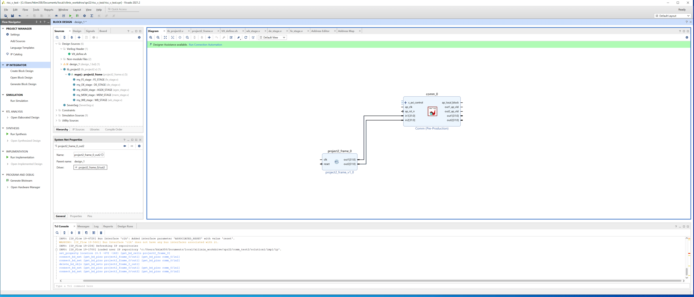

# Project 4 
**Due: 4/8/22 Friday (6:00 pm): Part-1 & part-2**
Both part-1 and part-2 dues are the same. 

This is a group project continuing on your project #3. 
In this project, you will test your RISC-V design on pynq board. 

## Part-1: Vivado Simulation (5 points) 
Before you run your design on FPGA (towers.mem), in this step you will simulate your design on Vivado's simulation. Vivado simulation models the hardware behavior more accurately than verilator. If your verilog code followed general HDL rules, you code would just run fine with vivado simulation. But if your code has uninitialized code or sequential code, it might not work with vivado simulation. In that case, you have to debug your code.  Those who were sensitive to the verilator versions might encounter this problem. 

Please make sure your add test code and set the path correctly. Please use towers.mem file that is released for project #3 part-2. Please review the "project2_vivado_check.mp4" in canvas/Files/videos. 

You can check last_WB_value[10] show 255. The example screenshot is as follows. 


**Grading** 

We will grade part-2. If Part-2 fails, we will review part-1's screenshot to give the partial credit. 


**What to submit** 

A screenshot to show instcount and r10 value. 
Please note that screenshot submission will be used for grading only when your part-2 fails to give a partial credit of project #4. 


##  Part-2: Run your pipeline on Pynq board (5 points) 
In this step, you will connect your pipeline with ARM processor similar to HW#10. 
More instructions will be posted soon. 


*[Step-1-Vitis]*
Create a comm IP from vitis. All steps are the same as HW #9. 
This vitis code doesn't have any contents other than having ports (inputs and output arguments)  to verilog modules with memory-mapped connection using AXI lite protocol.  So you can consider this vitis code as an AXI-Lite adopter, and luckily vitis generates all the necessary code for us. 


*[Step-2-Vivado]* 

[1] Create a new vivado project by adding project#2 frame (or you can use the same vivado which is used in part-1 of project #4) 
Please see wb_stage.v tb_project2.v project2_frame.v for your references. 

[1.a]  Now you modify project #2 frame to have two additional ports. 

```module project2_frame(
input clk,
input reset, 
output[31:0] out1,
output[31:0] out2
); 
```
in project2_frame.v 
connect out1 for cycle_count and connect out2 for reg10 value from WB stage 


``` 
assign out1 = cycle_count; 

```
in project2_frame.v 

add reg10 value ports in wb_stage.v 
example code 

```
assign reg10_val = 32'd33;  
 // assign reg10_val = 32'd33; // to check out2 works correctly

 //assign reg10_val = reg10_val_latch;  // to check reg10 value
```
```
 always @(posedge clk) begin

    //if ((last_WB_value[10] == 32'hff) && (reg10_val_latch == 0)) // reg10 should be 0xff
    if ((last_WB_value[10] == 32'hf0) && (reg10_val_latch == 0))  // intentionally check reg10 value is other than 0xff to really prove that this logic works as expected
        reg10_val_latch <= 32'hff;
  end

```

[1.b] Change the reset signal to be negative edge triggered 

'''assign reset = reset_bar;''' 

[1.c] change tb_project2.v as active low and add additional ports in project2_frame 


[2] Create a block design, IP repo setting to import IP from step-1, and add comm IP to the block diagram. 


[3] Add project2_frame to block diagram. 
 


[4] Connect project2_frame and comm module (in1 in common <-> out1, in2 in common <->out2) manually. 
 


[5] Add Zynq PS module from IP repo and then use auto-connect features to complete all the connections. If clock or reset connections are missing, you can connect them manually. 
 


[6]Create HDL wrapper go to “sources” and right click on your block design name, click on “Create HLD wrapper”. Click on “Let Vivado manage wrapper and auto-update” option and press “OK”. Make the design_wrapper as a *top module* by right clock in the source code "Set as Top". 

[7] Synthesize/implementation/ generate bitstreams

[9] Click on Project -> Generate Bitstream (it will ask to synthesize etc. and click yes)


[9] Click on File -> Export -> Export block design, select the option of including bitstream

[10] Copy files to prepare for upload them to pynq boards 

copy bit stream file .bit
.runs/impl_1/design_1_wrapper.bit 
copy tcl script file .tcl .runs/impl_1/design_1_wrapper.tcl
copy hwh file . .gen/sources_1/bd/design_1/hw_handoff   hwh file.

make sure name all the same file name (e.g. riscv.*) 

[11] Go to pynq boards and upload the files that are generated in the above step and also ipynb files.  start riscv_test.ipyb 

[12] read the contents and check out1 and out2 value. 
out1 value will keep changing since it's a cycle count and out2 value will be the constant that you put in step 1. 
*include the screenshot of ipynb on your report* 
[13] modify the wb_stage.v to check reg10 value. 
change reg10_val to store reg10_val_latch. 


[14] open Block Diagram and refresh the design 

 

[15] Run Synthesis/Implementation 

[16] Run simulation with three options (behavior simulation, post-synthesis/ post implementation functional simulations etc.)  and check reg10_val gets the expected value. 
*include the screenshots of simulations in your report* 


[17] Generate bistream and repeat the steps 8 -12 . Check whether out2 value is 255. 
*include the screenshot of ipynb on your report* 

[18] modify the wb_stage.v to check reg10 value to something else to prove that xff is only when it works fine. 
[19] Repeat the step to generate bitstreams run ipynb. 
*include the screenshot of ipynb on your report* 

**What to submit** 


[1] A report to include screenshots of 3 different simulations for towers.mem 
 (part-1, post synthesis/post implementation  functional/timing simulation) 
 
[2] A report to include screenshots of 3 different cases: 
  constant value as output, correct reg10 value check in WB_stage, incorrect reg10 value check  in WB_stage 
step-12, step-17, step-19. 

Please add explanations(add annotations in your screenshots) to explain that your design works as expected. 

[3] a zip file that includes  (riscv.zip) that includes. 
riscv.bit, riscv.hwh. riscv.tcl 

[4] a vivado xpr file prj4.zip 
(please make  sure all the  source code is included in the xpr file) 


**Grading policy** 

If you include your screenshot and show ipynb results, you will get at least 3 points regardless of whether your design works or not as longs as you complete all the steps. 
you should be able to generate riscv.bit file.
If your design works on board. (aka, you see out1 or out2 value shows 255), you will get a full credit (5 pts). 


**FAQ**

*Q: My design showed that r10 value is 255 but then it changes to another value. 

*A: Currently, we have not implemented the exit feature of the processor. Hence, the PC register value will start to fetch instructions after it overflows. For part-1, please adjust the simulation time. 


