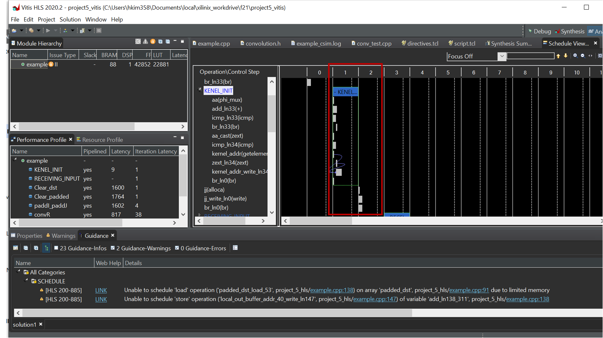

# CS3220 Assignment #5:  Edge detection FPGA accelerator

**Due date**: **12/3/2021 (F) : 6 pm**

This is a two-member group project.
(10 pts) 

Note: If you are running out of the time for doing this project #5, you can skip running the code in the pynq board and perform only vitis simulation. Vitis simulation only will give you 8 poits out of 10 points. 

**Description**:

In this assignment, you will analyze convolution operation that can be used in an edge detection mechanism using FPGA. The edge detection mechanism is based on the sobel edge algorithm. You can find the background knowledge at <a href="https://en.wikipedia.org/wiki/Sobel_operator"> wiki </a>

The sobel edge algorithm is built on top of the convolution function so we are offloading convolution operations in the FPGA. The convolution operations are built on using Vitis HLS and the rest of interface code is running on python. 
The files are provided in project5_files in the github. 

Due to the limited schedule, the scope of project #5 is just to understand vitis code optimization opportunities.  Running the code on Pynq boards is an optional task. 
Improving the performance over what we provide will be a bonus point. 

* *Part-1: Vitis-Only (10 pts)*  Understanding the HLS compiler's outcome reports. We provide a two different version convolution code to show different optimizations. 

example.cpp is a naive implementation and example1.cpp shows an optmized code.  and you can also look at hw#9's 2D convolution code for more sophicated optimizations (e.g. using <a href="https://basile.be/2019/03/18/a-tutorial-on-non-separable-2d-convolutions-in-vivado-hls/"> line buffer</a>)  From the report that is generated by vitis, you can see the compiler already performs loop unrolling, loop pipeling and other optimizations. Please look at solution/Open Report (Synthesis) and Solution/Open Schedule Viewer to analyze the results. Please use the vitis <a href="https://www.xilinx.com/support/documentation/sw_manuals/xilinx2019_2/ug1393-vitis-application-acceleration.pdf"> HLS manual </a> and/or <a href="https://www.xilinx.com/html_docs/xilinx2021_1/vitis_doc/vitis_hls_optimization_techniques.html?hl=2d%2Cfilter"> vitis documentation </a> for the reference of your explanations. 

In your report, based on the synthesized report from vitis, you need to explain what optimizations are performed by compiler or programmer. 
  You need to explain at least 3 different loops (explain what the optimization is doing, where the code is, and scheduling chart of the code, and whether the optimization was indeed succesful or not) 
 
e.g.) 
KERNEL_INIT
a snipet of code 
loop unrolling and pipeling are performed by the compiler. 
timing chart shows that add/compute/write are pipelined but still have idle cycles. 

Possible questions to answer? Which module becomes RAM? Does loop have a loop unrolling? which loops get benefits from array partitioning? Can you match the high-level source code and prodcued verilog code to check whether a loop is unrolled or pipelined? 

example.cpp, conv_test.cpp convolution.h are the main files that you need. example1.cpp can be used instead of example.cpp to see a different version. 
algorithm_2D_convolution_linebuffer directory is copied from hw#9's example for your reference. 

* *Part-2 (From vitis to Pynq boards) Optional task*

Now with the vitis code, you repeat the steps in HW#12. Instead "add+5"in HW#12, you substitue the example module with part-1' example IP. The steps to produce the vivado IR is the same as HW#12. Alternateivly, you can just upgrade the example IP module from HW#12's design. 
 
Now, we provide two different notebooks to test your vitis design. 

* example.cpp doesn't get synthesized. If you want to synthesize it, you need to reduce TEST_IMAGE_ROW/TEST_IMAGE_COL/TEST_IMAGE_SIZe as 30,30, 900. 
cv_edge_arm.ipynb and cv_edge_fpga.ipynb. 

cv_edge_arm performs sobel edge detection using ARM processors. Every operations are performed using python code. 
In cv_edge_fpga, convolution operations are offloaded to FPGA. 

*Bonus Points (up to 5 pts)*

If you are able to improve the performance on FPGA (at least 5%), you will receive bonus 5 points. If you only optimize your code into vitis and shows at least 5% latency reduction, you will receive bonus 2 points. 

Further optimization opportunities are 

Array partition 
Loop unrolling 
Utilize data flow 
Convert convolution operations as dense matrix multiplication 
Reduce the number of bits 
Improve the DMA features 
Using stream data structure 

Note: 
You can reduce the number of bits for computation. 
You cannot reduce the image resolution. 
You can increase the scope of offloading beyond the convolution operations. 
You can use different data structures to speed up the code. 
You cannot use the convolution IP module 

**What to submit** 
 
project5_report.pdf: (max 2 pages). 

*FAQ* 

* [Q]: I see Run-C simulation error. What should I do ? 
* [A]: C-Sim simulation might not pass. If that's the case, please ingore the error messages and focus on synthesizations. 

* [Q]: I try to run cv_edge_arm.ipynb but I got no CV, PIL library error? 
* [A]: you need to update your pynq board libraries. More instructions will be provided later. If you find a way, please post it at piazza. 

* [Q]: I run cv_edge_fpga.ipynb but I see only purple box. 
 [A]: The provided code still doesn't work well. please wait for the updated version. 

* [Q]: Where can I find the compiler's optimization results? 
* [A]: It's shown on console window or go to your vitis directory and under solution1, you will see solution1.log 

