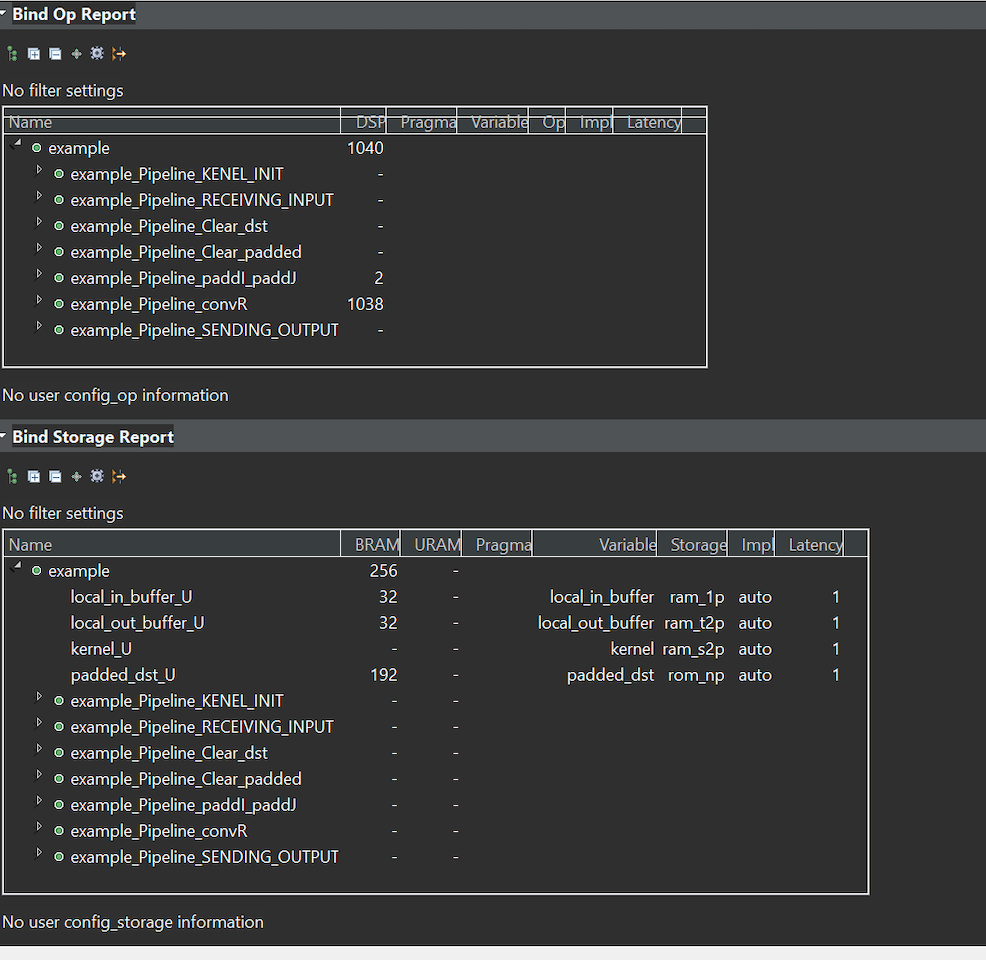

# CS3220 Assignment #5:  Edge detection FPGA accelerator

**Due date**: **4/25/2022 (Monday) : 6 pm**

This is a two-member group project (15 pts)

**Description**:

In this assignment, you will develop an edge detection mechanism using FPGA. The edge detection mechanism is based on the sobel edge algorithm. You can find the background knowledge at <a href="https://en.wikipedia.org/wiki/Sobel_operator"> wiki </a>

The sobel edge algorithm is built on top of the convolution function so we are offloading convolution operations in the FPGA. The convolution operations are built on using Vitis HLS and the rest of interface code is running on python. 
The files are provided in project5_files in the github. 

The provided convolution operation is very basic implementaiton which cannot be scaled up. Scaling up the convolution operation is your main task in thie project. 

* *Part-1: Improving the provided Convolution (13 pts)*  

example.cpp is a naive CNN implemenation. Due to the navie implemenation only 30x30 size can fit into  zynq board. 
Your job is to optimize the code so that a large image can fit into the board. 
To optimize the code, understanding the HLS compiler's outcome reports are critical.
Please do not use stream data structure which is for part-3. 
Please look at solution/Open Report (Synthesis) and Solution/Open Schedule Viewer to analyze the results. Please use the vitis <a href="https://www.xilinx.com/support/documentation/sw_manuals/xilinx2019_2/ug1393-vitis-application-acceleration.pdf"> HLS manual </a> and/or <a href="https://www.xilinx.com/html_docs/xilinx2021_1/vitis_doc/vitis_hls_optimization_techniques.html?hl=2d%2Cfilter"> vitis documentation </a> for the reference of your explanations.

In this design, you will optimize your code to optimize so that it can handle bigger image sizes. 
You should have at least 4 designs to compare. At least two of them should be refactoring the code but the rest can be just trying out different pragmas. 

Possible options of code are 
[1] Utilize HLS pragmas 
[2] Remove copy loops 
[3] Convert the code to use tiled convolution operation.  Your design should be synthesizable. 
Please refer to [https://sharc-knowledgebase.netlify.app/articles/cnn/tiling-based_convolution_for_hls](this content)

[4] Convert the code to use line buffers:  Please see  algorithm_2D_convolution_linebuffer directory is copied from hw#9's exampele. Complete convolution implementation based on the line buffer. Using line buffer, you can even scale up your design. Please synthesize the code and check the results. 

In you report, you should report  a screenshot of latency table and the total latency (sum of the latency) . 
You should also show BRAM and DSP unit usage for your designs.   

* *Part-2 Produce Bit-stream and running it on Pynq boards* (2 pts) 
* (Please skip this part until further notification) 

Now with the provided vitis code, you repeat the steps in HW#12. Instead "add+5"in HW#12, you substitue the example module with part-1' example IP. The steps to produce the vivado IR is the same as HW#12. Alternateivly, you can just upgrade the example IP module from HW#12's design. 
 
Now, we provide two different notebooks to test your vitis design. 

* To synthesize the file you need to reduce TEST_IMAGE_ROW/TEST_IMAGE_COL/TEST_IMAGE_SIZe as 30,30, 900. 
cv_edge_arm.ipynb and cv_edge_fpga.ipynb. 

cv_edge_arm performs sobel edge detection using ARM processors. Every operations are performed using python code. 
In cv_edge_fpga, convolution operations are offloaded to FPGA. 

We will set class hours to provide 

 

**What to submit** 
 
[1] project5_report.pdf: (max 2 pages). 
[2] bit stream of the best performing design & tcl & hwh 
[3] source code of your example.cpp 
[4] Vivado project  (please include the source code) 
[5] A screenshot of the notebook jupyter 

*FAQ* 

* [Q]: Where can I find the compiler's optimization results? 
* [A]: It's shown on console window or go to your vitis directory and under solution1, you will see solution1.log 

* [Q]: what should I discuss in the report? 
* [A]: Discuss what optimizations you did and how the latency has been changed. 

